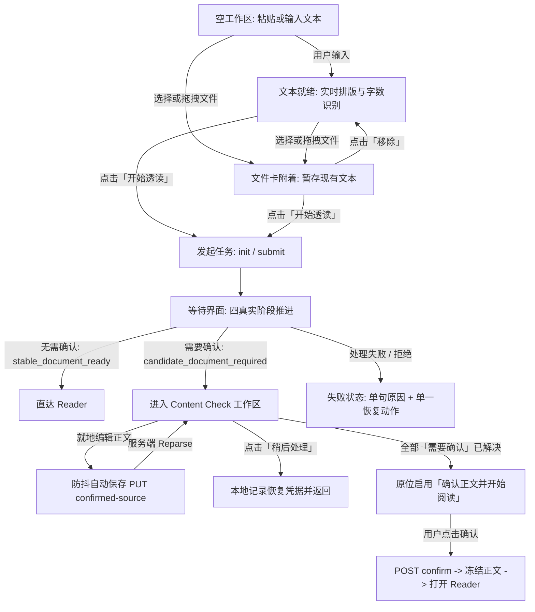

# Read Intake & Content Check Surface Specification

> **Owner decision date**: 2026-08-29
>
> **Design status**: approved for implementation
>
> **Implementation status**: not yet complete
>
> **Surface role**: Claread Web 内容录入、文件上传/OCR、等待阶段与 Content Check 审查工作区（`/app/read` 及 resume 恢复入口）
>
> **Authority**: 本文档为 Claread Web Read Intake 与 Content Check 唯一的正式 Surface Brief，固化 Owner 已确认的产品与设计决策。不修改 `PRODUCT.md`、`DESIGN.md` 或架构文档；未完成的底层能力列入实现依赖。

---

## 1. Job and Audience

### 访客模式
**Operate 模式**（阅读优先、低噪、Pragmatic Minimalism）。用户到达该表面是为了把一份英文材料安全、高质量地带入 Claread，形成一段稳定可读的阅读经历；核心要求是清晰可控、反馈克制、零视觉表演、快速进入阅读。

### 到达人群与使用场景
- **桌面 Web 用户（主场景）**：长时间面对浏览器，从剪贴板粘贴文本/Markdown，或拖拽上传 PDF、TXT、Markdown、截图/扫描件（OCR）。用户希望立即确认文章内容结构是否被正确理解，对高风险格式（代码围栏、公式、表格、乱序）进行审阅与必要校正，随后进入 Reader。
- **移动 Web 用户（次场景/响应式适配）**：在手机或平板浏览器上查看、补充输入或恢复已暂存的审查任务，完成轻量确认后开始阅读。

### 核心心智模型
用户面对的是**一篇文章的准备过程**，不是分布式任务看板、AI workflow trace 或代码审查控制台。一切技术细节（OCR 置信度数值、解析管线阶段名、AST 节点、Python 异常堆栈）均不得侵入主视觉；系统仅在真正需要用户做语义决断时靠近。

---

## 2. Outcome and Proof

### 主要任务与成功定义
1. **单一输入闭环**：在同一个稳定工作区内完成文本粘贴、Markdown 实时排版编辑、文件暂存/上传与阅读方案选择；点击“开始透读”后无缝进入处理。
2. **免打扰直达**：对于低风险文本/Markdown（`stable_document_ready`），解析完成后直接打开 Reader（`/app/reader/{recordId}`），不增加多余确认屏。
3. **精准人机协作成文**：对于高影响风险（OCR 噪声、公式退化、未闭合围栏、结构不确定表格、段落乱序等进入 `candidate_document_required`），工作区平滑切至 Content Check 状态：
   - 用户能在中央正文画布直接阅读和就地编辑。
   - 右侧固定批注栏将问题分为“需要确认”与“提示”。
   - 所有“需要确认”项处理完毕后，原位激活“确认正文并开始阅读”。
   - 确认后正文冻结为不可变 Stable Reading Document 并进入 Reader。
4. **真实进度与可离开承诺**：等待处理过程中只展示真实阶段，后端接管后用户离开页面不丢失任务，完成后在阅读记录中可见并收到轻量站内通知。

### 产品专有真实性（Product Proof）
- Claread 是英文深度阅读与学习工具，不是通用 OCR 工具，也不是代码审查平台。Content Check 的目标是产出**适合舒适阅读的正文**，而不是强迫用户对排版做像素级修复。

---

## 3. Selected Direction

### 视觉权威与设计语言
严格遵从 `apps/web/DESIGN.md` 的 **“Notion-like Pragmatic Minimalism for Reading”**：
- **表面结构**：以平面表面（`surface-canvas`、`surface`、`surface-raised`）、细分隔线（`hairline`）和受控留白建立层级，坚决禁止多层卡片堆叠、拟物渐变、发光边框或磨砂毛玻璃。
- **色彩秩序**：单一强调色 `lens-blue`（`#1f5eff`）严格受限于主要行动、键盘焦点与激活指示；黄色 `feedback-warning` 仅用于待确认批注提示，禁止大面积彩色警示背景；正文维持严肃阅读墨阶（`ink` / `reader-reading-ink`）。
- **动效克制**：仅允许 150–200ms 的微距过渡（fade-in / slide-in）；支持 `prefers-reduced-motion` 降级为即时显隐；禁止任何“AI 正在思考”的旋转光圈、呼吸扫描光效或骨架屏波浪表演。

### 结构与交互主张
1. **同一稳定工作区原则**：输入、文件附着、等待、Content Check 发生在同一个页面容器内，维持版心稳定，不产生路由跳跃，不设立两套割裂的输入体系。
2. **Markdown 编辑器为主表面**：编辑器不是传统 `<textarea>`，而是所见即所得的 Plate 结构化输入面；文件上传是工作区内的次级动作，而非独立全屏流程。
3. **就地收口原则**：Content Check 解决全部必决项后，主操作按钮原地更新为可点击状态，用户主动点击进入 Reader；不弹出庆祝弹窗，不自动强制跳转，不新增无意义的总结报告页。

---

## 4. Scope and Explicit Anti-Goals

### 覆盖范围
- 页面路由：`/app/read` 及带着恢复参数的 `/app/read?resume_candidate={recordId}`。
- 功能生命周期：
  1. 空白与草稿录入态（MarkdownTextInput 实时高亮与结构识别）。
  2. 文件拖拽/选择附着态与草稿安全暂存机制。
  3. 四阶段真实进度等待态与失败恢复。
  4. Content Check 审查工作区（正文画布、批注栏、左侧原件抽屉、底部操作条）。
  5. 离开与同浏览器恢复（Save/Recovery）。

### 显式反目标（Strict Anti-Goals）
1. **禁止建立两套独立输入流程**：不能把“粘贴文本”和“文件上传”做成分离的 Tab 或独立页面；文件上传附着在输入工作区之上。
2. **禁止虚假进度与装饰表演**：禁止使用平滑递增的伪百分比（如“已完成 47%”）、虚构的任务时间线、或任何装饰性大插画（如巨型纸张透镜透视插画）。
3. **禁止全篇红绿代码审查（No GitHub PR Style）**：Content Check 不是代码 diff 工具，禁止全屏大面积铺设红底删除、绿底新增的代码对比；diff 仅在单个选中问题卡片内局部展开，使用中性表面与低饱和弱对比表现。
4. **禁止锚点模糊猜测（No Fuzzy Guessing）**：文本修改后若源坐标漂移失效，必须明确展示“位置已变化”，绝不得通过相似度算法自动猜测并高亮错误文本段。
5. **禁止文档级问题伪造文本锚点**：对篇幅过长、代码占比过高、来源整体提示等全局问题，必须归入“全文检查”，不得在正文第一行或任意段落伪造假标记。
6. **禁止编辑后自动判定解决**：用户编辑正文后，问题卡片仅转换为“内容已修改，待确认”，必须由用户显式点击确认，系统不得替用户擅自消除需要确认项。
7. **禁止引入第二套解析与渲染引擎**：输入端与 Reader 共享 Markdown AST 与排版尺度，禁止引入 `lowlight`、`highlight.js`、第二套 Markdown preview iframe 或双重 parser。
8. **禁止发明自定义快捷键体系**：除全局 `Cmd/Ctrl+K` 与系统标准编辑键（Tab、Enter、Esc、Ctrl+Z/Redo）外，不得为批注操作定义自定义单字母快捷键，避免与输入法和屏幕阅读器冲突。
9. **禁止自动跳转离开审查**：解决完最后一个问题卡片后，禁止未经用户点击直接自动切换页面。

---

## 5. Surface Topology and Sequence

### 页面拓扑结构（Desktop）

```text
┌─────────────────────────────────────────────────────────────────────────────────────────────┐
│ 页面顶栏（App Shell）：导航、用户菜单、历史入口                                               │
├─────────────────────────────────────────────────────────────────────────────────────────────┤
│ 紧凑页头：来源标识（如「来源：annual_report.pdf」） ｜ 提示：「正文可直接修改，修改会自动保存」   │
├────────────────────────────────────────────────────────────────────────┬────────────────────┤
│                                                                        │ 批注侧边栏          │
│ [原件抽屉 (按需展开 40–45%)] │ 中央 Candidate 正文画布                   │ (固定 320–360px)   │
│                              │                                        │ 待办概览条         │
│  - 原 PDF / 图像 / 纯文本    │  - 纯净阅读版心 (65–75ch)               │  - 共 X 项，待确认 Y│
│  - 双向高亮联动              │  - Plate 结构化实时编辑器              │  - 下一个待确认     │
│  - 缺坐标时显示「未能定位」   │  - 行首/边缘 Gutter Markers             │ ────────────────── │
│                              │  - 极淡范围高亮背景                     │ 动态卡片列表       │
│                              │  - 支持直接就地打字与标准撤销           │  - 激活项展开       │
│                              │                                        │  - 其余项折叠       │
│                              │                                        │  - 局部 Unified Diff│
│                              │                                        │  - 全文检查卡片     │
├──────────────────────────────┴────────────────────────────────────────┴────────────────────┤
│ 底部操作栏（固定高度，贴底工作面）：                                                          │
│  [左侧] 保存状态指示（「已自动保存」/「保存中…」）                                              │
│  [右侧] [稍后处理]  [重新输入(若有)]  ───────────────────────  [确认正文并开始阅读 (Primary)]│
└─────────────────────────────────────────────────────────────────────────────────────────────┘
```

### 状态推进序列



---

## 6. State Matrix

工作区在生命周期内遵循闭合状态转移，各状态的表现、进入条件与操作约束如下表：

| 状态 ID | 状态名称 | 视觉呈现 | 主要动作 | 次要/退出动作 | 约束与守卫 |
|---|---|---|---|---|---|
| `S1_IDLE_EMPTY` | 空白输入 | 居中 Plate 编辑器，展示占位文案；右下 Primary 按钮禁用；底部上传入口可见 | 聚焦输入 / 拖入文件 | - | 按钮处于 disabled |
| `S2_DRAFT_TYPING` | 文本输入中 | 编辑器呈现结构化文本；底部状态栏显示近似词数与识别标记（标题/代码块/表格等） | 点击「开始透读」 | 清空内容（右上 X） | 文本 trim 后非空方可激活开始按钮 |
| `S3_FILE_STAGED` | 文件附着就绪 | 编辑器隐藏，居中展示紧凑「落签卡」：文件名、格式图标、文件大小、四阶段预告；若存在草稿则提示“已暂存你粘贴的内容，移除文件后恢复” | 点击「开始透读」 | 更换文件 / 移除文件 | 只能附着单文件；移除后自动回填暂存文本并聚焦编辑器 |
| `S4_WAIT_UPLOAD` | 阶段一：上传文件 | 居中文件卡，展示当前阶段呼吸点；进度指示“上传文件中” | - | 取消上传 | 上传直传 OSS，支持中断 |
| `S5_WAIT_EXTRACT` | 阶段二：提取正文 | 居中文件卡，指示“正在提取正文”；副标题：“离开本页不会影响适读，完成后会保存到阅读记录” | 允许离开页面 | - | 后端接管，生成 reading_record_id |
| `S6_WAIT_CHECK` | 阶段三：检查内容 | 居中文件卡，指示“正在检查内容安全与排版适用性” | 允许离开页面 | - | 适用性门控执行中 |
| `S7_WAIT_PREPARE` | 阶段四：准备阅读 | 居中文件卡，指示“内容已就绪，正在准备阅读环境” | - | - | 即将跳转进入 Reader |
| `S8_WAIT_FAILED` | 等待失败/超时 | 工作区红/灰色弱警示框；仅展示一句用户语言失败原因 | 单一恢复动作（「重试」） | 单一退出动作（「重新选择文件」或「返回修改」） | 禁止展示 Python 堆栈、worker lease 或 OSS 错误码 |
| `S9_CHECK_READY` | 审查待办态 | 拓扑完全展开：正文画布 + 右侧批注栏。存在未决的“需要确认”项 | 逐项审阅批注卡 | 稍后处理 / 重新输入（仅初次提交） | 主按钮文案为“确认正文并开始阅读”，保持 disabled 状态 |
| `S10_CHECK_EDITING` | 审查就地编辑态 | 正文直接输入，底部状态栏显示“保存中…”；1200ms 防抖后发起 PUT；关联批注标记转为“内容已修改，待确认” | 继续编辑 / 点击保存 | 稍后处理 | 严禁自动将问题标记为已解决；PUT 乐观锁带 `expected_revision` |
| `S11_CHECK_CONFLICT` | 审查并发冲突 | 顶部横幅提示“检测到内容有更新” | 「以我的修改重试」（递增 revision 重放） | 「载入最新版本」（放弃本地修改） | 服务端永不静默覆盖；本地编辑内容绝对不丢失 |
| `S12_CHECK_RESOLVED` | 审查全部就绪 | 所有“需要确认”项已解决；“提示”项可残留或已折叠确认；正文无未保存 dirty | 「确认正文并开始阅读」（原位高亮启用） | 稍后处理 | 原位激活，不弹窗，不自动跳转 |
| `S13_CONFIRMING` | 正在冻结正文 | 主按钮显示 loading 态“确认中…”；界面不可重复点击 | - | - | POST candidate confirm 幂等提交 |

---

## 7. Content Check Issue Model

### 问题类型分层（Two-Tier Model）

后端 `AdaptationRecord` 严格映射为前端两类审查对象：

1. **需要确认（Attention Tier - 阻塞型）**
   - **定义**：直接破坏作者原意、导致正文边界丢失、结构断裂或严重影响长时间阅读体验的高风险项。
   - **必须处理**：每一个需要确认项必须被用户显式过目并点击“确认当前内容”，或经编辑/自动修复后确认。未清零前，主 CTA 保持禁用。
   - **闭合代码集**：
     - `has_unclosed_fence`：代码块未闭合（提供一键自动闭合）。
     - `table_structure_uncertain`：表格列不对齐或表头缺失。
     - `missing_source_range`：内容无法对齐回源文档。
     - `layout_order_uncertain`：OCR/双栏排版顺序不确定。
     - `code_dominant`：代码占比过高缺少散文叙述。
     - `too_long_requires_envelope`：全文篇幅过长（>8000词）。
     - `unclosed_html_aside`：侧栏/注解 HTML 标签未闭合。

2. **提示（Routine Tier - 非阻塞型）**
   - **定义**：系统已执行确定性降级、清理或规范化，正文完整性不受威胁，仅需向用户知会的格式项。
   - **处理规则**：允许保留在界面上；用户可以点击单个“确认”，也可以点击批注栏顶部的“确认全部普通建议”，**亦可完全不处理直接进入阅读**。
   - **闭合代码集**：
     - `source_type_review_default`：来源默认过目（PDF/URL/OCR 通用提示）。
     - `ocr_low_confidence`：局部字符识别置信度偏低。
     - `image_ocr_uncertain`：正文中含有无法提取文字的图片。
     - `document_block_degraded`：公式语法降级为文本。
     - `footnote_reference`：脚注转为文末或普通说明。
     - `task_list_unsupported`：任务列表转换为常规列表文本。
     - 清理类通告：`raw_html_block`、`inline_html`、`unsafe_link_protocol`、`definition_list_degraded`、`mermaid_static_only`、`strikethrough_extension`。

### 锚点模型与失效处理
- **局部锚点**：基于 Markdown 块行号与范围生成。正文画布在对应行左侧留白处显示细点 Gutter Marker，正文文字衬有极淡的背景色（透明度 ≤ 8% 的 warning 色）。
- **双向定位联动**：
  - 点击批注卡上的“查看位置”：正文平滑滚动至对应块，该行 Gutter Marker 与背景产生一次 300ms 的清晰聚焦强调（不晃动）。
  - 点击正文中的 Gutter Marker 或带有问题标记的文本块：右侧批注栏自动滚动并将对应问题卡片置为当前展开态。
- **全文检查（Document-Level）**：对于 `source_type_review_default`、`code_dominant`、`too_long_requires_envelope` 等全局问题，固定展示在批注列表最顶部的“全文检查”分区中，**严禁在正文第 1 行或任意段落伪造假 Gutter Marker**。
- **锚点失效保护（Anchor Drift Guard）**：用户在画布中增删换行或修改段落后，原有字符范围可能失效。此时前端对比校验，一旦无法精准定位，卡片右上角标明 **“位置已变化”**，卡片内“查看位置”按钮置灰并提示“内容已移动，请浏览全文”；**绝对禁止使用模糊匹配（Fuzzy Guessing）错误圈定相邻段落**。
- **编辑后状态机**：用户在某项批注对应范围内编辑文字后，卡片状态从“需要确认”转为“内容已修改，待确认”。系统**绝不自动将该项标记为已解决**，依然需要用户按一下“确认当前内容”。

### 局部 Unified Diff 规则
- 仅在用户点击选中的当前问题卡片内部展开局部对比。
- **禁止全篇红绿代码审查**：
  - 背景采用中性表面 `surface-raised`。
  - 删除内容采用柔和的删除线（`line-through` + `text-muted-foreground`），不使用大片鲜红背景。
  - 替换或修复内容采用中性浅墨色细边框包裹，不使用亮绿荧光色。
  - 仅展示当前问题前后 1~2 行上下文，不展示完整文档 diff。

### 原件抽屉（Source Drawer）
- 点击批注卡或页头的“查看原件”，从视口左侧滑出抽屉，固定宽度约 40%–45%。
- 支持展示原 PDF 页面渲染快照、上传的图片原图或原始文本。
- 若后端返回了可靠的版面坐标（Bounding Box），在原件对应位置叠放半透明线框。
- **无坐标降级**：若来源为纯文本或 OCR 引擎未下发准确坐标，原件抽屉顶部明确显示提示：**“未能精确定位，仅展示参考原件”**，并展示整页供人工对照，绝不随意框选原件顶部。

---

## 8. Interaction and Keyboard Contract

### 键盘交互契约
1. **焦点顺序（DOM Tab Order）**：
   - 顶栏导航与来源信息 →
   - Candidate 正文编辑器（光标可自由编辑） →
   - 批注栏待办统计栏（“下一个待确认”） →
   - 当前展开的批注卡操作区（“查看位置”、“确认当前内容”、“采用建议”） →
   - 底部操作栏（“稍后处理”、“确认正文并开始阅读”）。
2. **快捷操作键**：
   - `Tab` / `Shift+Tab`：在上述交互控件间正向/反向流转。
   - `Enter` / `Space`：激活聚焦的按钮或展开/收起批注卡。
   - `Esc`：若左侧原件抽屉处于打开状态，优先关闭抽屉；若原件抽屉已关闭且当前处于某张展开卡片上，收起当前展开卡片并将焦点还给该卡片卡头。
   - `Ctrl+Z` / `Cmd+Z`：在编辑器内触发标准撤销。
   - `Ctrl+Shift+Z` / `Cmd+Shift+Z`（或 `Ctrl+Y`）：在编辑器内触发标准重做。
3. **焦点返回保证**：
   - 关闭原件抽屉后，焦点强制返回到当初触发打开的批注卡“查看原件”按钮上。
   - 确认某个问题卡片后，焦点自动移向下一个未决的批注卡标题，若全部解决则移向底部主 CTA “确认正文并开始阅读”。

### 语言规则
- 界面操作与系统提示**全部统一为严谨中文**。
- 英文仅保留：
  - Claread 品牌名与专有名词（如 Claread Web、Reader、Plate）。
  - 代码块语言标签（如 Python、TypeScript、Rust）。
  - 用户提交的英文原始内容。

---

## 9. Responsive Behavior

### 断点拓扑（Desktop / Tablet / Mobile）

| 视口规格 | 宽度范围 | 拓扑形态与布局规则 | 触控与手势要求 |
|---|---|---|---|
| **Desktop (宽屏)** | `≥ 1024px` (lg) | 标准三栏/双栏：原件抽屉（40–45% 浮层）+ 中央 Candidate 正文（居中，版心 65–75ch）+ 右侧固定批注栏（320–360px）+ 贴底操作条。 | 键盘焦点与鼠标悬浮完全支持。 |
| **Tablet (中屏)** | `640px – 1023px` (sm/md) | 正文画布占全宽；批注栏收拢为右侧可滑入的 Sheet 面板（默认收起，顶部徽标显示未决数量）；原件抽屉占屏幕 60% 宽度。 | 触控目标保持 `≥ 44×44px`。 |
| **Mobile (小屏)** | `< 640px` (max-sm) | 单列纵向布局：<br>1. 顶部紧凑状态条：展示来源、未决数量与“下一个”按钮。<br>2. 正文画布全屏滚动浏览与输入。<br>3. 底部可拖拽 Bottom Sheet：承载批注卡片，默认露出 56px Peek 栏，上拉展开半屏/全屏审阅。<br>4. 原件对比以全屏 Modal 弹出。 | 关键按钮最小点击尺寸严格保证 `min-h-[44px]` 与 `min-w-[44px]`；支持向下滑动收起 Bottom Sheet。 |

---

## 10. Markdown Rendering Contract

### 输入端与 Reader 的一致性基准
- **共享语义与排版尺度**：输入工作区（`MarkdownTextInput`）与 Reader 正文画布严格共享统一的排版基准，包括行高（`leading-[1.68]`）、字体家族（`ui` 与 `reading` 规范）、标题梯度（H1–H6）、引用块边框、表格单元格间距与链接下划线样式。
- **共享 CSS 类名与 Token**：
  - 正文容器：`.reader-record-plate-document`
  - 段落：`.reader-record-plate-markdown-p`
  - 标题：`.reader-record-plate-markdown-heading--h1` ~ `h6`
  - 列表：`.reader-record-plate-markdown-list`
  - 引用：`.reader-record-plate-markdown-blockquote`
  - 代码块：`.reader-record-plate-markdown-code-block`
  - 行内代码：`.reader-record-plate-inline-code`
  - 链接：`.reader-record-plate-link`
- **安全白名单与不可见字符处理**：
  - 链接仅允许 `http:`, `https:`, `mailto:` 协议；不安全协议（如 `javascript:`, `data:`）强制降级为普通纯文本 `<span>`，不可点击。
  - Raw HTML 标签（`<script>`, `<iframe>`, `<div>` 等）直接剥离可执行结构，不渲染 DOM 节点。
  - 不可见控制字符、零宽空白按架构规则在规范化层清洗。

### 输入 Chrome vs. Reader Chrome
- **输入端特有 Chrome**：支持直接聚焦编辑的光标（Caret）、占位引导文案（Placeholder）、拖拽附着遮罩、行首批注标记（Gutter Markers）、待办高亮背景。
- **Reader 特有 Chrome**：句子级选择焦点、机器词汇释义浮层（`vocab_highlight`）、句后语法拆解卡（`grammar_note` / `sentence_analysis`）、第二阅读层段级译文。
- **实现红线**：输入端**不得直接复用 Reader 的 readOnly DOM 结构**；两者通过 Plate 插件与同一套 CSS 规范对齐，而不是将输入态强行嵌入 Reader 组件内。

### 代码块语法高亮（Shiki）
- **单一引擎保证**：输入端的 fenced code 代码块复用 Reader 已有的 Shiki tokenizer，采用 Plate 的 transient decoration 机制实现只读语法高亮展示。
- **严禁外部冗余库**：绝对不得引入 `highlight.js`、`lowlight`、`prism.js` 或自定义正则着色器。
- **语言标签映射表**：规范常见语言显示名称：
  - `python` / `py` → `Python`
  - `typescript` / `ts` → `TypeScript`
  - `javascript` / `js` → `JavaScript`
  - `cpp` / `c++` → `C++`
  - `csharp` / `c#` → `C#`
  - `rust` / `rs` → `Rust`
  - `go` / `golang` → `Go`
  - 未知语言保留原始输入的字符串，不随意猜测。
- **工具栏差异**：输入端的代码块**不显示复制按钮工具栏**（复制栏仅存在于 Reader 只读模式）。

---

## 11. Save & Recovery Contract

### 正文版本三态模型（Product Contract）
产品层向用户承诺的三态正文版本视图：
1. **初始提取版本（Initial Extracted Revision）**：后端材料化产生的不可变原始正文基线。无论后续如何编辑，随时可通过“恢复初始提取内容”取回。
2. **上一个已保存版本（Previous Saved Revision）**：上一次成功通过 PUT 同步到服务端的正文快照。
3. **当前编辑版本（Current Working Revision）**：用户当前在编辑器内实时输入的草稿。
- **版本推进规则**：系统**不提供无限历史分支树或版本滑动时间线**。当用户触发“恢复初始提取内容”或“恢复上次保存内容”时，系统将所选版本的内容拉入当前编辑器，并**生成一个新的递增当前 revision**（例如在 rev 3 基础上恢复 rev 1，将生成 rev 4 提交），保证版本号严格单调递增。

### 上传任务同浏览器恢复机制（Browser Recovery）
首版实现基于同浏览器 LocalStorage 进行韧性保护，防止误关标签页或网络波动：
1. **Init 上传阶段**：`init-upload` 成功后，将 `{ artifactId, filename, phase: "uploading", timestamp }` 写入存储。
2. **Submit 提交阶段**：`submit-input` 成功后，追加 `{ readingRecordId, originalInputId, phase: "polling" }`。
3. **页面加载挂载（Mount Recovery）**：
   - 页面启动时检查本地是否存在未完成任务。
   - 若存在，直接调用 `GET /api/web/reader/source-artifacts/{id}/pipeline-status` 查询真实状态。
   - 若任务已到达 `candidate_document_required`，直接无缝转入 Content Check 状态。
   - 若已到达 `stable_document_ready`，直接导航进入 Reader。
4. **存储清理规则**：只有当任务到达终态（成功进入 Reader、用户在界面显式点击“重新输入”或“放弃任务”），才从本地存储清除。

### 后端当前实现事实与工程依赖（Engineering Reality Gap）
> **重要实现依赖说明**：
>
> 当前后端通过 migration 0025 `confirmed_source_documents` 表管理草稿，其采用 `expected_revision` 乐观并发控制，但底层执行的是**原地 UPDATE 覆盖 `markdown_text`**，数据库目前未持久化保存初始提取版本（v0）的独立历史记录行。
>
> 因此，上述“不可变初始提取版本”在当前后端尚不满足，属于**待补充的后端实现依赖**。前端当前切勿伪称已有完整历史回滚接口；在后端支持版本快照前，前端仅能在本地会话内暂存初次加载的快照作为临时基线。

---

## 12. UX Copy Inventory

本表收录所有面向用户的正式文案，严禁在实现中散落硬编码或夹杂英文开发调试词汇：

| 模块 | 位置 / 场景 | 用户可见文案 | 说明 |
|---|---|---|---|
| **输入工作区** | 编辑器占位符 | “粘贴英文文章，或直接开始输入” | 主占位 |
| | 编辑器副占位符 | “支持 Markdown / PDF / TXT / 图片” | 格式提示 |
| | 状态提示 | “约 {N} 词 · 已识别{结构列表}” | 结构识别反馈 |
| | 清空按钮 Tooltip | “清空” | 右上角操作 |
| | 暂存提示 | “已暂存你粘贴的内容，移除文件后恢复” | 文件附着时提示 |
| | 计划选择器摘要 | “日常阅读 · 进阶” / “备考精读 · 雅思托福” | 映射方案配置 |
| | 主操作按钮 | “开始透读” / “透读中…” | Primary Action |
| **等待阶段** | 阶段一（上传） | “正在上传文件…” | 真实四阶段之一 |
| | 阶段二（提取） | “正在提取正文…” | 真实四阶段之二 |
| | 阶段三（检查） | “正在检查内容与排版…” | 真实四阶段之三 |
| | 阶段四（准备） | “正在准备阅读环境…” | 真实四阶段之四 |
| | 可离开承诺副标 | “离开本页不会影响透读，完成后会保存到阅读记录” | 静默处理保证 |
| | 失败主说明 | “暂时没能识别这份文件，请换一个格式重试” | 失败单句原因 |
| | 失败主动作 | “重新上传” / “以文本粘贴” | 恢复入口 |
| **Content Check** | 页头标题 | “确认识别出的正文” | 工作区主标题 |
| | 页头来源说明 | “来源：{文件名}” / “来源：粘贴文本” | 来源溯源 |
| | 自动保存提示 | “已自动保存” / “保存中…” / “保存失败，点击重试” | 底部状态指示 |
| | 待办概览 | “共 {total} 项内容需要过目，还有 {attention} 项需要确认” | 顶部统计 |
| | 批注分类标签 | “需要确认” / “提示” | Tier 徽章 |
| | 锚点失效状态 | “位置已变化” | 严禁模糊匹配 |
| | 编辑后待确认 | “内容已修改，待确认” | 编辑后状态 |
| | 卡片主动作 | “查看位置” / “确认当前内容” / “采用建议” | 批注卡按钮 |
| | 批注顶栏批处理 | “确认全部普通建议” | 针对 Routine 项 |
| | 底部主操作 | “确认正文并开始阅读” / “确认中…” | 清零后原位启用 |
| | 底部次级操作 | “稍后处理” / “重新输入” | 安全退出/返回 |
| | 原件抽屉标题 | “参考原件对比” | 抽屉标题 |
| | 原件缺坐标提示 | “未能精确定位，仅展示参考原件供比对” | 降级说明 |
| | 冲突处理弹窗 | “内容已在其他位置更新，请选择处理方式” | 409 冲突文案 |
| | 冲突解决按钮 | “载入最新版本（放弃本地修改）” / “以我的修改重试” | 冲突双动作 |

---

## 13. Backend & Frontend Implementation Dependencies

### 已落地的确认后端事实（Confirmed Backend Facts）
1. **上传与提取流水线**：
   - 路由：`POST /source-artifacts/init-upload`、`POST /source-artifacts/{id}/complete-upload`、`POST /source-artifacts/{id}/submit-input`。
   - 状态查询：`GET /source-artifacts/{id}/pipeline-status`，返回安全的 `ReaderArtifactPipelineStatusSafeDto`（包含 `stage`, `outcome`, `next_action`）。
2. **适用性评估与分类代码**：
   - `input_suitability_gate.py` 产出冻结的三字段结构：`code`, `message`, `classification`（`content_check` vs `adaptation_notice`）。
   - 闭合代码集已由 `file-upload-parse-chain-markdown.md §9` 固化。
3. **Confirmed Source 草稿与确认**：
   - 读取：`GET /records/{id}/confirmed-source`。
   - 更新：`PUT /records/{id}/confirmed-source`，携带 `expected_revision` 与全篇 Markdown，返回更新后的 Candidate 与 checks。
   - 最终确认：`POST /records/{id}/candidate-documents/{cid}/confirm`，将 Candidate 提升为 Stable Document 并写入 `reading_bases` 与 `article_ready` 事件。

### 待实现的工程依赖（Open Implementation Dependencies）
1. **正文历史版本支持（Backend Gap）**：
   - 依赖项：数据库与 API 需支持持久化保存 `initial_extracted_markdown`，并在 `GET /confirmed-source` 时下发初始版本指纹，以支撑产品合同承诺的“恢复初始提取内容”而不依赖客户端本地脆弱缓存。
2. **OCR / PDF 原件坐标下发（Backend Gap）**：
   - 依赖项：`candidate_reading_documents` 需补充下发对应文本段的 `bounding_boxes` 与 `page_number`，以便前端原件抽屉实现像素级线框高亮；在下发前，前端严格走“未能精确定位”的整页降级逻辑。
3. **Shiki Tokenizer 的 Plate Transient Decoration 插件封装（Frontend Task）**：
   - 依赖项：将 Reader 既有的 Shiki 引擎抽离为供可编辑 Plate 使用的轻量 decoration 插件，确保输入端编辑时不触发全量 DOM 重建与中文输入法打断。
4. **同浏览器 LocalStorage 任务管理器抽象（Frontend Task）**：
   - 依赖项：建立标准化的 `read-intake-recovery-store`，统一管理上传任务、草稿暂存、过期清理与刷新自动水合。

---

## 14. Browser Acceptance Matrix

所有前台实现必须在以下环境完成矩阵验收：

| 平台 / 设备 | 浏览器内核 | 验证重点 | 门禁标准 |
|---|---|---|---|
| **macOS Desktop** | Chrome (Blink) 最新版 | 正常渲染、拖拽文件、Shiki 代码高亮、中文输入法（IME）输入流畅度。 | 无无故重渲染，拼音输入不丢字，滚动顺畅。 |
| **macOS Desktop** | Safari (WebKit) 最新版 | 原件抽屉滑出性能、100dvh 视口高度、CSS sticky 底部操作条、SVG 图标渲染。 | 无水平溢出，抽屉滑出无闪烁，字体对齐严格。 |
| **Windows Desktop** | Edge / Chrome 最新版 | 中文默认字体（Microsoft YaHei / PingFang）回退、滚动条宽度补偿、Ctrl 快捷键响应。 | 布局不因系统默认滚动条跳动，Ctrl+Z 正常响应。 |
| **iOS Mobile** | Safari (WebKit) | 软键盘弹出时视口缩放防护、拖拽 Bottom Sheet 手势、44px 最小触控区域。 | 软键盘不遮挡当前编辑行，底部 Sheet 拖拽流畅。 |
| **Android Mobile** | Chrome (Blink) | 虚拟返回键响应、底层滚动穿透防御、上传文件选择器唤起。 | 返回键正确关闭原件抽屉或 Sheet，无滚动穿透。 |
| **全局辅助功能** | 全平台 (VoiceOver / NVDA) | 屏幕阅读器语义（`aria-expanded`, `aria-live="polite"`, `role="dialog"`）、纯键盘 Tab 导航。 | 批注状态变更有语音提示，焦点闭环无陷阱。 |
| **动效偏好** | 全平台 | `prefers-reduced-motion: reduce` 系统设置。 | 所有进场动画与呼吸光圈立即变为静态或无位移淡入淡出。 |

---

## 15. NOT_IMPLEMENTED / Open Engineering Risks

1. **大长篇 Markdown 编辑器性能风险（Risk 1）**：
   - *风险*：当用户输入接近 8,000 词的长文时，实时运行 Markdown 解析与 Shiki 高亮可能引起击键延迟。
   - *缓解措施*：解析与高亮必须运行在 Web Worker 或通过 `requestIdleCallback` 批处理，禁止逐键阻塞主线程。
2. **后端单版本覆盖与并发丢修改风险（Risk 2）**：
   - *风险*：后端当前为原地更新，若用户在两个标签页同时打开同一记录审查，可能频繁报 409。
   - *缓解措施*：前端必须完整接入 `reloadLatest` 与以本地版本重试的提示界面，绝不可静默吃掉冲突。
3. **坐标数据缺失导致的原件定位期望落差（Risk 3）**：
   - *风险*：用户期待点击“查看原件”能够像专业 PDF 阅读器一样直接高亮原件那一行，但第一阶段后端无法提供精确 bounding box。
   - *缓解措施*：明确展示“未能精确定位，仅展示参考原件”，管理用户预期，避免被误判为功能 Bug。
4. **输入端与阅读端 Token 漂移风险（Risk 4）**：
   - *风险*：后续若开发者随意在输入端增加独立的 CSS 工具类，会导致“输入时看起来像一种排版，进入 Reader 变成另一种排版”。
   - *防护红线*：任何修改必须同时运行 `@claread/web` 的 parity 单元测试，强制输入端与阅读端锁定同一份 Tailwind token 与排版规范。
