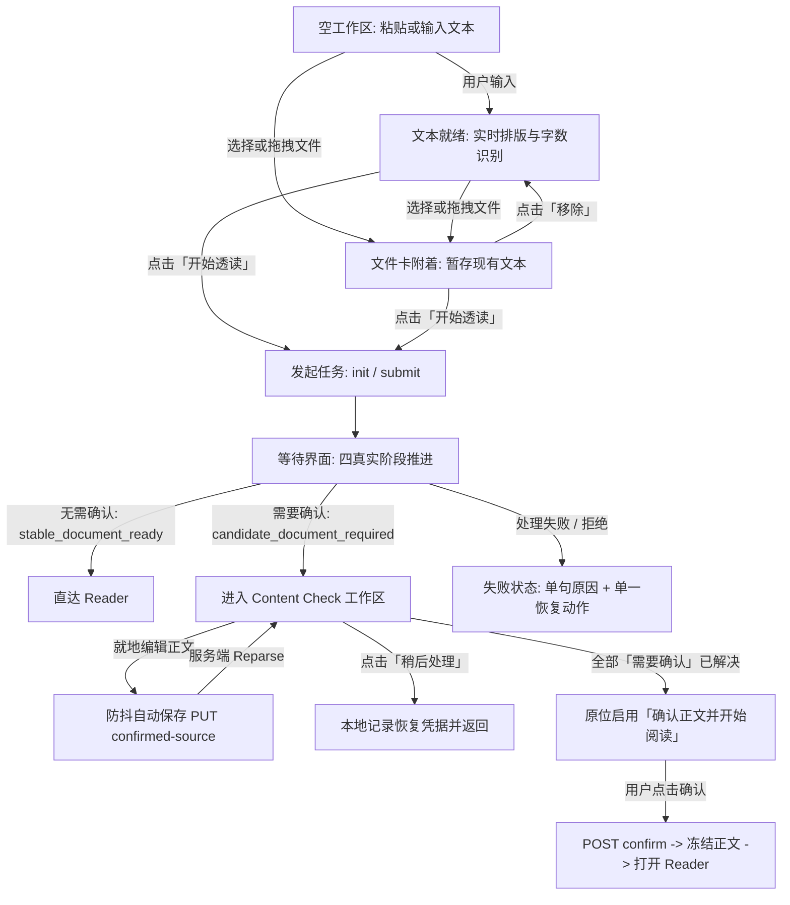

# Read Intake & Content Check Surface Specification

> **Owner decision date**: 2026-08-29
>
> **Design status**: approved for implementation
>
> **Implementation status**: not yet complete
>
> **Surface role**: Claread Web 内容录入、文件上传/OCR、等待阶段与 Content Check 审查工作区（`/app/read` 及 resume 恢复入口）
>
> **Authority**: 本文档为 Claread Web Read Intake 与 Content Check 唯一的正式 Surface Brief，固化 Owner 已确认的产品与设计决策。R3 Contract Closeout 固化最终 Owner 决策与底层交付合同闭环。不修改 `PRODUCT.md`、`DESIGN.md` 或架构文档；未完成的底层能力列入实现依赖。

---

## 1. Job and Audience

### 访客模式
**Operate 模式**（阅读优先、低噪、Pragmatic Minimalism）。用户到达该表面是为了把一份英文材料安全、高质量地带入 Claread，形成一段稳定可读的阅读经历；核心要求是清晰可控、反馈克制、零视觉表演、快速进入阅读。

### 到达人群与使用场景
- **桌面 Web 用户（主场景）**：长时间面对浏览器，从剪贴板粘贴文本/Markdown，或拖拽上传 PDF、TXT、Markdown、截图/扫描件（OCR）。用户希望立即确认文章内容结构是否被正确理解，对高风险格式（代码围栏、公式、表格、乱序）进行审阅与必要校正，随后进入 Reader。
- **移动 Web 用户（次场景/响应式适配）**：在手机或平板浏览器上查看、补充输入或恢复已暂存的审查任务，完成轻量确认后开始阅读。

### 核心心智模型
用户面对的是**一篇文章的准备过程**，不是分布式任务看板、AI workflow trace 或代码审查控制台。一切技术细节（OCR 置信度数值、解析管线内部阶段名、AST 节点、Python 异常堆栈）均不得侵入主视觉；系统仅在真正需要用户做语义决断时靠近。

---

## 2. Outcome and Proof

### 主要任务与成功定义
1. **单一输入闭环**：在同一个稳定工作区内完成文本粘贴、Markdown 实时排版编辑、文件暂存/上传与阅读方案选择；点击“开始透读”后无缝进入处理。
2. **免打扰直达**：对于低风险文本/Markdown（`stable_document_ready`），解析完成后直接打开 Reader（`/app/reader/{recordId}`），不增加多余确认屏。
3. **精准人机协作成文**：对于高影响风险（OCR 噪声、公式退化、未闭合围栏、结构不确定表格、段落乱序等进入 `candidate_document_required`），工作区平滑切至 Content Check 状态：
   - 用户能在中央正文画布直接阅读和就地编辑。
   - 右侧固定批注栏将问题分为“需要确认”与“提示”。
   - 所有“需要确认”项处理完毕后，原位激活“确认正文并开始阅读”。
   - 确认后正文冻结为不可变 Stable Reading Document 并进入 Reader。
4. **真实进度与可离开承诺**：等待处理过程中只展示真实阶段，后端接管后用户离开页面不丢失任务，完成后在阅读记录中可见并收到轻量站内通知。

### 产品专有真实性（Product Proof）
- Claread 是英文深度阅读与学习工具，不是通用 OCR 工具，也不是代码审查平台。Content Check 的目标是产出**适合舒适阅读的正文**，而不是强迫用户对排版做像素级修复。

---

## 3. Selected Direction

### 视觉权威与设计语言
严格遵从 `apps/web/DESIGN.md` 的 **“Notion-like Pragmatic Minimalism for Reading”**：
- **表面结构**：以平面表面（`surface-canvas`、`surface`、`surface-raised`）、细分隔线（`hairline`）和受控留白建立层级，坚决禁止多层卡片堆叠、拟物渐变、发光边框或磨砂毛玻璃。
- **色彩秩序**：单一强调色 `lens-blue`（`#1f5eff`）严格受限于主要行动、键盘焦点与激活指示；黄色 `feedback-warning` 仅用于待确认批注提示，禁止大面积彩色警示背景；正文维持严肃阅读墨阶（`ink` / `reader-reading-ink`）。
- **动效克制**：仅允许 150–200ms 的微距过渡（fade-in / slide-in）；支持 `prefers-reduced-motion` 降级为即时显隐；禁止任何“AI 正在思考”的旋转光圈、呼吸扫描光效或骨架屏波浪表演。

### 结构与交互主张
1. **同一稳定工作区原则**：输入、文件附着、等待、Content Check 发生在同一个页面容器内，维持版心稳定，不产生路由跳跃，不设立两套割裂的输入体系。
2. **Markdown 编辑器为主表面**：编辑器不是传统 `<textarea>`，而是所见即所得的 Plate 结构化输入面；文件上传是工作区内的次级动作，而非独立全屏流程。
3. **就地收口原则**：Content Check 解决全部必决项后，主操作按钮原地更新为可点击状态，用户主动点击进入 Reader；不弹出庆祝弹窗，不自动强制跳转，不新增无意义的总结报告页。

---

## 4. Scope and Explicit Anti-Goals

### 覆盖范围
- 页面路由：`/app/read` 及带着恢复参数的 `/app/read?resume_candidate={recordId}`。
- 功能生命周期：
  1. 空白与草稿录入态（MarkdownTextInput 实时高亮与结构识别）。
  2. 文件拖拽/选择附着态与草稿安全暂存机制。
  3. 四阶段真实进度等待态与失败恢复。
  4. Content Check 审查工作区（正文画布、批注栏、左侧原件抽屉、底部操作条）。
  5. 离开与同浏览器恢复（Save/Recovery）。

### 显式反目标（Strict Anti-Goals）
1. **禁止建立两套独立输入流程**：不能把“粘贴文本”和“文件上传”做成分离的 Tab 或独立页面；文件上传附着在输入工作区之上。
2. **禁止虚假进度与装饰表演**：禁止使用平滑递增的伪百分比（如“已完成 47%”）、虚构的任务时间线、或任何装饰性大插画（如巨型纸张透镜透视插画）。
3. **禁止全篇红绿代码审查（No GitHub PR Style）**：Content Check 不是代码 diff 工具，禁止全屏大面积铺设红底删除、绿底新增的代码对比；diff 仅在单个选中问题卡片内局部展开，使用中性表面与低饱和弱对比表现。
4. **禁止锚点模糊猜测（No Fuzzy Guessing）**：文本修改后若源坐标漂移失效，必须明确展示“位置已变化”，绝不得通过相似度算法自动猜测并高亮错误文本段。
5. **禁止文档级问题伪造文本锚点**：对篇幅过长、代码占比过高、来源整体提示等全局问题，必须归入“全文检查”，不得在正文第一行或任意段落伪造假标记。
6. **禁止编辑后自动判定解决**：用户编辑正文后，问题卡片仅转换为“内容已修改，待确认”，必须由用户显式点击确认，系统不得替用户擅自消除需要确认项。
7. **禁止引入第二套解析与渲染引擎**：输入端与 Reader 共享 Markdown AST 与排版尺度，禁止引入 `lowlight`、`highlight.js`、第二套 Markdown preview iframe 或双重 parser。
8. **禁止发明自定义快捷键体系**：除全局 `Cmd/Ctrl+K` 与系统标准编辑键（Tab、Enter、Esc、Ctrl+Z/Redo）外，不得为批注操作定义自定义单字母快捷键，避免与输入法和屏幕阅读器冲突。
9. **禁止自动跳转离开审查**：解决完最后一个问题卡片后，禁止未经用户点击直接自动切换页面。
10. **禁止静默覆盖活动任务**：本地已存在活动输入任务时，严禁静默覆盖；必须由用户显式选择“继续旧任务”或“替换并开始新任务”。
11. **禁止长文增加独立概览页**：长文或多页文件在批注栏内提供结构导航，正文始终是中央主画布，不打乱三栏/双栏拓扑。

---

## 5. Surface Topology and Sequence

### 页面拓扑结构（Desktop）

```text
┌─────────────────────────────────────────────────────────────────────────────────────────────┐
│ 页面顶栏（App Shell）：导航、用户菜单、历史入口                                               │
├─────────────────────────────────────────────────────────────────────────────────────────────┤
│ 紧凑页头：来源标识（如「来源：annual_report.pdf」） ｜ 提示：「正文可直接修改，修改会自动保存」   │
├────────────────────────────────────────────────────────────────────────┬────────────────────┤
│                                                                        │ 批注侧边栏          │
│ [原件抽屉 (按需展开 40–45%)] │ 中央 Candidate 正文画布                   │ (固定 320–360px)   │
│                              │                                        │ 待办概览条         │
│  - 原 PDF / 图像 / 纯文本    │  - 纯净阅读版心 (65–75ch)               │  - 共 X 项，待确认 Y│
│  - 双向高亮联动              │  - Plate 结构化实时编辑器              │  - 下一个待确认     │
│  - 缺坐标时显示「未能定位」   │  - 行首/边缘 Gutter Markers             │ ────────────────── │
│                              │  - 极淡范围高亮背景                     │ [长文/多页结构导航] │
│                              │  - 支持直接就地打字与标准撤销           │  - 可信大纲/页码导航│
│                              │                                        │  - Attention 数量点│
│                              │                                        │  - 当前可见节指示  │
│                              │                                        │ ────────────────── │
│                              │                                        │ 动态卡片列表       │
│                              │                                        │  - 激活项展开       │
│                              │                                        │  - 其余项折叠       │
│                              │                                        │  - 局部 Unified Diff│
│                              │                                        │  - 全文检查卡片     │
├──────────────────────────────┴────────────────────────────────────────┴────────────────────┤
│ 底部操作栏（固定高度，贴底工作面）：                                                          │
│  [左侧] 保存状态指示（「已自动保存」/「保存中…」） ｜ [版本恢复菜单]                          │
│  [右侧] [稍后处理]  [重新输入(若有)]  ───────────────────────  [确认正文并开始阅读 (Primary)]│
└─────────────────────────────────────────────────────────────────────────────────────────────┘
```

### 长文与多页文件结构导航（Structure Overview）
为了解决长篇或多页材料难以把握审查全貌的问题，在桌面批注栏顶部（待办概览下方、卡片列表上方）增加轻量、可折叠的**文档结构导航区**：
1. **触发契约与事实来源**：
   - 结构概览**完全由后端或稳定结构层提供的可信结构元数据（如 `long-document` 标识、章节 `outline` 或分页 `page metadata`）决定**。
   - 规格**不冻结任何硬编码数字阈值**（如固定词数、标题数量或页数限制）；具体大纲提取或触发阈值属于可配置工程参数，需基于真实材料后续校准，不作为冻结产品事实。
2. **内容要素**：
   - 展示材料可确认的天然章节结构（如 H1/H2 标题）或分页标识（如“第 1 页”、“第 2 页”）。
   - 每个结构项右侧标明该区域内未决的 `Attention`（需要确认）数量徽章（如“§2 核心架构 · 2 项待确认”）。
   - 当前正在正文画布视口内阅读的章节/页码展示高亮激活点。
3. **交互行为与红线**：
   - 点击结构项：正文画布平滑滚动至对应章节或页码起点，并自动激活该区域内首个待确认问题卡片。
   - 严禁行为：不得在结构区复制大段正文内容；不得占用独立全屏页面；不得将所有 Routine（提示）项平铺在结构区（Routine 仍收纳在下方卡片流）。
4. **短文自适应与缺失降级**：
   - 短篇材料或缺少可信结构元数据时，结构导航区默认折叠或不渲染。
   - 严禁基于正文字符长度、标题字面相似度或客户端启发式算法盲目猜测虚假层级；结构信息不足时仅展示当前可确认的标题或“全文”确认项统计。
5. **移动端收纳**：在移动端，结构导航作为独立折叠区嵌入 Bottom Sheet 顶部，避免增加额外页面层级。

### 状态推进序列



---

## 6. State Matrix & Real Phase Mapping

### 四阶段与真实后端状态映射表（True Backend Mapping）

> **关键事实订正**：后端 DTO（`ReaderArtifactPipelineStatusResponse` 与前端安全映射 `ReaderArtifactPipelineStatusSafeDto`）**根本不存在根级 `stage` 字段**。
>
> 普通 UI 路由必须严格优先消费安全的公开状态对：`outcome` 与 `next_action`，并结合 `artifact.status`、`candidate_document` 及 `stable_document` 进行组合推导。嵌套的 `job.status == 'failed_terminal'` 仅作为辅助排查证据，**绝对不得绕开已冻结的公开 outcome / next_action 合同**。严禁读取臆造字段，严禁使用虚假百分比。

下表定义客户端展现的“四个真实阶段”与后端真实字段的精确映射契约，覆盖全部 13 个公开 outcome 与 8 个公开 next_action：

| 客户端展示阶段 | 业务含义 | 后端真实字段判定条件 | 用户界面指示文案 | 允许动作 |
|---|---|---|---|---|
| **阶段一：上传文件** | 浏览器文件准备、获取 OSS 预签名 URL、直接上传至 OSS、通知完成上传 | 1. 预请求：本地选择文件并校验通过；<br>2. 初始化：`POST /source-artifacts/init-upload`；<br>3. 直传中：`artifact.status == 'pending'`，`outcome == 'upload_pending'`，`next_action == 'complete_upload'`；<br>4. 完成通知：`POST /source-artifacts/{id}/complete-upload` 成功后 `artifact.status == 'available'`，`outcome == 'upload_available_not_submitted'`，`next_action == 'submit_input'`。 | “正在上传文件…” | 取消上传 / 移除文件 |
| **阶段二：提取正文** | 提交解析任务，后台 Worker 执行文本解码或 OCR 识别 | 1. 提交任务：`POST /source-artifacts/{id}/submit-input`；<br>2. 执行中：`outcome IN ('extraction_queued', 'extraction_running', 'extraction_retry_later')`，`next_action IN ('wait_for_worker', 'retry_later')`（此时 `extraction_job.status IN ('queued', 'claimed', 'retry_later')`）；<br>3. 成功终态：`extraction_job.status == 'succeeded'`；<br>4. **提取失败**：`outcome == 'extraction_failed'`，`next_action == 'show_error'`（此时 `extraction_job.status == 'failed_terminal'`，转入 S8 失败状态）。 | “正在提取正文…”<br>副标：“离开本页不会影响透读，完成后会保存到阅读记录” | 允许安全离开页面 |
| **阶段三：检查内容** | 适用性门控评估、Markdown 解析、结构排版与合规检查 | 1. 执行中：`outcome IN ('materialization_queued', 'materialization_running', 'materialization_retry_later')`，`next_action IN ('wait_for_worker', 'retry_later')`（此时 `materialization_job.status IN ('queued', 'claimed', 'retry_later')`）；<br>2. 产生候选：`outcome == 'candidate_document_required'`，`next_action == 'confirm_candidate_document'`，`candidate_document` 非空（进入 Content Check）；<br>3. 拒绝输入：`outcome == 'input_rejected_or_action_required'`，`next_action == 'revise_input'`；<br>4. **材料化失败**：`outcome == 'materialization_failed'`，`next_action == 'show_error'`（此时 `materialization_job.status == 'failed_terminal'`，转入 S8 失败状态）。 | “正在检查内容与排版…”<br>副标：“离开本页不会影响透读，完成后会保存到阅读记录” | 允许安全离开页面 |
| **阶段四：准备阅读** | 确定性冻结正文、生成 Reading Base 与 Anchor Segments，交接进入 Reader | 1. 免确认直达：`outcome == 'stable_document_ready'`，`next_action == 'open_reader'`，`stable_document` 非空，`record.active_base_id` 非空；<br>2. 审查后确认：用户在 Content Check 界面确认后，`POST /records/{id}/candidate-documents/{cid}/confirm` 执行事务写入完成。<br>*注：此阶段是确定的终态握手，不是独立的后台排队 Job。* | “正在准备阅读环境…” | 准备跳转进入 Reader |

### 完整页面状态机矩阵

| 状态 ID | 状态名称 | 触发与进入条件 | 视觉呈现 | 主要动作 | 次要/退出动作 | 约束与守卫 |
|---|---|---|---|---|---|---|
| `S1_IDLE_EMPTY` | 空白输入 | 初始进入或清空文本 | 居中 Plate 编辑器，展示占位文案；右下 Primary 按钮禁用；底部上传入口可见 | 聚焦输入 / 拖入文件 | - | 按钮处于 disabled |
| `S2_DRAFT_TYPING` | 文本输入中 | 文本框存在输入内容 | 编辑器呈现结构化文本；底部状态栏显示近似词数与识别标记（标题/代码块/表格等） | 点击「开始透读」 | 清空内容（右上 X） | 文本 trim 后非空方可激活开始按钮 |
| `S3_FILE_STAGED` | 文件附着就绪 | 选择或拖入合法文件 | 编辑器隐藏，居中展示紧凑「落签卡」：文件名、格式图标、文件大小、四阶段预告；若存在草稿则提示“已暂存你粘贴的内容，移除文件后恢复” | 点击「开始透读」 | 更换文件 / 移除文件 | 只能附着单文件；移除后自动回填暂存文本并聚焦编辑器 |
| `S4_WAIT_UPLOAD` | 阶段一：上传文件 | 开始上传至完成上传 | 居中文件卡，展示阶段一呼吸细点；指示“正在上传文件…” | - | 取消上传 | 上传直传 OSS，支持网络中断 |
| `S5_WAIT_EXTRACT` | 阶段二：提取正文 | `submit-input` 已完成，提取 Worker 运行中 | 居中文件卡，展示阶段二呼吸细点；指示“正在提取正文…”；副标提示可离开 | 允许离开页面 | - | 后端接管，生成 reading_record_id |
| `S6_WAIT_CHECK` | 阶段三：检查内容 | 提取成功，材料化 Worker 运行中 | 居中文件卡，展示阶段三呼吸细点；指示“正在检查内容与排版…” | 允许离开页面 | - | 适用性门控执行中 |
| `S7_WAIT_PREPARE` | 阶段四：准备阅读 | 冻结就绪或确认完毕 | 居中文件卡，展示阶段四呼吸细点；指示“正在准备阅读环境…” | - | - | 即将跳转进入 Reader |
| `S8_WAIT_FAILED` | 等待失败/超时 | `outcome IN ('extraction_failed', 'materialization_failed')` 且 `next_action == 'show_error'`（嵌套 job.status 仅作辅助诊断） | 工作区展示红/灰色弱警示框；仅展示一句用户语言失败原因 | 单一恢复动作（「重试」） | 单一退出动作（「重新选择文件」或「返回修改」） | 禁止展示 Python 堆栈、worker lease 或 OSS 错误码 |
| `S9_CHECK_READY` | 审查待办态 | `outcome == 'candidate_document_required'` | 拓扑完全展开：正文画布 + 右侧批注栏。存在未决的“需要确认”项 | 逐项审阅批注卡 | 稍后处理 / 重新输入（仅初次提交） | 主按钮文案为“确认正文并开始阅读”，保持 disabled 状态 |
| `S10_CHECK_EDITING` | 审查就地编辑态 | 用户在 Candidate 画布键入修改 | 正文直接输入，底部状态栏显示“保存中…”；1200ms 防抖后发起 PUT；关联批注标记转为“内容已修改，待确认” | 继续编辑 / 点击保存 | 稍后处理 | 严禁自动将问题标记为已解决；PUT 乐观锁带 `expected_revision` |
| `S11_CHECK_CONFLICT` | 审查并发冲突 | PUT 接口返回 HTTP 409（公开错误码 `stale_source_revision`；仓储内部 `stale_revision` 仅作后端日志记录） | 顶部横幅提示“检测到内容在其他位置有更新” | 「以我的修改重试」（自动拉取最新 revision 重放本地文本） | 「载入最新版本」（放弃本地修改） | 服务端永不静默覆盖；本地编辑内容绝对不丢失 |
| `S12_CHECK_RESOLVED` | 审查全部就绪 | 全部“需要确认”项已解决；正文无未保存修改 | 「确认正文并开始阅读」（原位高亮启用） | 稍后处理 | 原位激活，不弹窗，不自动跳转 |
| `S13_CONFIRMING` | 正在冻结正文 | 用户点击主 CTA | 主按钮显示 loading 态“确认中…”；界面遮罩防重 | - | - | POST candidate confirm 幂等提交 |
| `S14_TASK_CONFLICT` | 活动任务存在冲突 | 本地存在进行中的活动任务，用户尝试新建输入 | 弹出居中选择对话框：“检测到未完成的任务” | 「继续旧任务」 | 「替换并开始新任务」 | 严禁任何形式的静默覆盖（禁止 Last-Write-Wins） |

---

## 7. Content Check Issue Model & Classification

### 后端 Classification 与产品 Tier 的严格映射

后端架构（`file-upload-parse-chain-markdown.md §9`）严格输出三态分类（Backend Classification）。前端必须遵循清晰的消费管道，严禁混淆：

```text
Backend Classification:
 ├── (1) silent            ──► 永不上屏（底层规范化，如 strikethrough_extension，零 UI 干扰）
 ├── (2) adaptation_notice ──► 非阻断通知轨（折叠通告栏，如 HTML 剥离、不安全链接协议剥离）
 └── (3) content_check     ──► Content Check 审查卡片流
                                ├── [Product Tier A] Routine (提示)   ──► 非阻塞，可一键批量过目，不阻断阅读
                                └── [Product Tier B] Attention (需要确认) ──► 阻塞型，必须逐项过目确认方可开始阅读
```

> **核心原则**：
>
> `Routine` 与 `Attention` 是 Claread 前端针对 `content_check` 内部定义的产品交互 Tier（分层），**绝不是后端 classification 的替代枚举**。
>
> `strikethrough_extension` 的权威后端分类为 `silent`，**严禁**将其作为 Routine 项出现在审查卡片中。

### 详细代码归属与行为清单

| 后端代码 (code) | 后端分类 | 产品 Tier | 来源与触发条件 | 阻塞行为 | 建议文案与自动修复能力 |
|---|---|---|---|---|---|
| `strikethrough_extension` | `silent` | *无 (不上屏)* | GFM 删除线转换为文本 | 否 | 语义确定，用户不可见。 |
| `raw_html_block` | `adaptation_notice` | *通知轨* | 剥离大段 HTML 可执行标签 | 否 | 仅在通知轨展示：“网页标记已清理”。 |
| `inline_html` | `adaptation_notice` | *通知轨* | 剥离段落行内 HTML 标签 | 否 | 仅在通知轨展示：“行内网页标记已去掉”。 |
| `unsafe_link_protocol` | `adaptation_notice` | *通知轨* | 剥离 `javascript:` 等不安全链接 | 否 | 仅在通知轨展示：“不安全链接已去掉”。 |
| `definition_list_degraded`| `adaptation_notice` | *通知轨* | 定义列表降级为普通文字 | 否 | 仅在通知轨展示：“定义列表已按普通文字处理”。 |
| `mermaid_static_only` | `adaptation_notice` | *通知轨* | 图示代码块仅作为静态代码保留 | 否 | 仅在通知轨展示：“图示按代码源码留下”。 |
| `source_type_review_default` | `content_check` | **Routine (提示)** | PDF/URL/OCR 等来源默认过目 | 否 | “提取的正文建议你看一眼再开始阅读”；无自动修复。 |
| `ocr_low_confidence` | `content_check` | **Routine (提示)** | OCR 字符置信度低或含噪声 | 否 | “对照原图或原文件看一眼关键段落再开始阅读”；无自动修复。 |
| `image_ocr_uncertain` | `content_check` | **Routine (提示)** | 正文中含有图片引用 | 否 | “图片信息不会自动进入正文，重要的话请补成文字”；无自动修复。 |
| `document_block_degraded` | `content_check` | **Routine (提示)** | 数学公式降级为普通文本 | 否 | “公式可能显示不完整，请确认是否还要保留”；无自动修复。 |
| `footnote_reference` | `content_check` | **Routine (提示)** | 脚注引用标记 | 否 | “脚注无法进入正文结构，建议留作普通文字或括号说明”；无自动修复。 |
| `task_list_unsupported` | `content_check` | **Routine (提示)** | GFM 任务列表复选框 | 否 | “勾选状态已作为普通文字留下，可按需整理”；无自动修复。 |
| `has_unclosed_fence` | `content_check` | **Attention (需要确认)** | 代码块缺少闭合 ` ``` ` | **是** | “代码块缺少结束围栏，建议补上结束标记”；**支持「采用建议」一键自动修复**。 |
| `table_structure_uncertain` | `content_check` | **Attention (需要确认)** | 表格行列数与表头不对齐 | **是** | “表格结构识别不准，建议检查内容与列对齐”；无自动修复。 |
| `missing_source_range` | `content_check` | **Attention (需要确认)** | 内容无法映射回原始文件坐标 | **是** | “部分内容无法对应回原文，建议确认内容是否完整”；无自动修复。 |
| `layout_order_uncertain` | `content_check` | **Attention (需要确认)** | OCR 双栏或复杂版面阅读顺序存疑 | **是** | “版面阅读顺序不太确定，建议核对段落先后”；无自动修复。 |
| `code_dominant` | `content_check` | **Attention (需要确认)** | 代码行数占比过高缺少散文 | **是** | “这份内容以代码为主，批注价值有限，请确认是否继续”；归入全文检查。 |
| `too_long_requires_envelope`| `content_check` | **Attention (需要确认)** | 全文篇幅过长超出处理边界 | **是** | “全文过长，建议拆分后再进行深度阅读”；归入全文检查。 |
| `unclosed_html_aside` | `content_check` | **Attention (需要确认)** | `<aside>` 标签未闭合 | **是** | “一段侧栏结构不完整，建议检查附近内容”；无自动修复。 |

---

## 8. Interaction and Keyboard Contract

### 键盘交互与焦点规则
1. **焦点流转顺序（Tab Sequence）**：
   - 顶栏来源说明 →
   - 正文 Candidate 编辑器（可直接键入编辑） →
   - 批注栏结构导航（若展示） →
   - 待办概览条（“下一个待确认”） →
   - 激活展开的批注卡操作按钮（“查看位置”、“确认当前内容”、“采用建议”、“查看原件”） →
   - 底部操作条（“版本恢复菜单”、“稍后处理”、“确认正文并开始阅读”）。
2. **快捷操作约束**：
   - 严禁发明自定义单字母快捷键（如按 `C` 确认、按 `N` 下一个），避免与用户在正文编辑器内的正常英文输入发生灾难性冲突。
   - `Enter` / `Space`：激活聚焦的按钮或折叠/展开结构项。
   - `Esc`：若原件抽屉打开，优先关闭抽屉并还焦点给“查看原件”按钮；若抽屉已关闭，收起当前展开的批注卡。
   - `Ctrl+Z` / `Cmd+Z`：由 Plate 编辑器在本地维护的**单会话内撤销栈**；与跨会话或刷新后的“版本恢复”具有完全独立的语义和操作入口。

---

## 9. Responsive Behavior & Mobile Accessibility

### 断点与触控基准
- **Desktop (≥ 1024px)**：标准三栏/双栏：原件抽屉（40–45%）+ 中央正文（65–75ch）+ 右侧固定批注栏（320–360px）+ 贴底操作栏。
- **Tablet (640px – 1023px)**：正文全宽；批注栏收拢为右侧滑入 Sheet 面板；原件抽屉占屏幕 60%。
- **Mobile (< 640px)**：单列正文浏览 + 顶部紧凑状态条 + 底部可拖拽 Bottom Sheet。所有关键按钮尺寸严格保证 `min-h-[44px]` 与 `min-w-[44px]`。

### 移动端 Bottom Sheet 无障碍与容器语义合同（Accessibility Contract）
1. **现有可访问 Primitive 底座保证**：
   - 必须使用现有可访问 Sheet/Dialog primitive（如 Radix UI Dialog / Sheet primitive 或语义等价封装），**严禁自研新的焦点管理框架**。
   - Sheet 容器必须具备明确的 Accessible Name，通过 `aria-labelledby`（指向标题）或 `aria-label="审查批注面板"` 提供。
   - 展开形态遵循模态语义，配置 `aria-modal="true"`。
   - 触发按钮通过 `aria-controls` 与 Sheet 面板建立关联（若底层 primitive 支持）。
2. **显式切换控件（Explicit Controls）**：
   - 严禁仅依赖滑动手势！Bottom Sheet 顶部 Peek 状态条必须配备清晰可见、触控区域至少 44×44px 的展开/收起切换按钮。
   - 按钮提供严格的语义属性：`aria-expanded="true" | "false"`，并附带动态 `aria-label`（如“展开审查批注面板，还有 2 项需要确认” / “收起审查批注面板”）。
3. **焦点包含（Focus Containment）与返回管理**：
   - 展开 Sheet 时：焦点自动进入 Sheet 内部，优先置于当前激活的待确认问题卡片标题；
   - 包含规则：Sheet 展开期间必须具备**焦点包裹（Focus Containment / Trap）**，用户连续按 `Tab` 键焦点只能在 Sheet 内部循环，**严禁逃逸至被置为 inert 的底层正文画布**；
   - 关闭 Sheet 时：焦点精确返回到触发展开的状态条按钮，或返回到正文画布中刚才定位的 Gutter Marker。
   - 实体按键：移动端支持外接键盘时，按 `Esc` 必须能够关闭 Sheet。
4. **背景惰性隔离（Inert Background）**：
   - 当 Bottom Sheet 处于半屏或全屏展开状态时，底层的正文画布容器必须动态设置 `inert` 属性（或 `aria-hidden="true"` 并拦截底层滚动），防止屏幕阅读器将焦点读入底层背景，杜绝背景误触打字或滚动穿透。
5. **读屏器状态播报**：
   - 批注项状态变更（如确认无误、内容修改待确认、自动保存）必须通过局部 `aria-live="polite"` 容器向辅助技术即时宣告。
   - 绝不依赖颜色或纯图标来传达“需要确认”与“提示”状态。

---

## 10. Markdown Rendering Contract

### 输入端与 Reader 的一致性基准
- **排版尺度完全对齐**：输入工作区（`MarkdownTextInput`）与 Reader 正文画布共享完全相同的 CSS 样式规则：正文 `leading-[1.68]`、字体族（`ui` 与 `reading`）、标题层级（H1–H6）、引用块排版与表格边框。
- **共享 CSS 类名与 Token**：
  - 正文容器：`.reader-record-plate-document`
  - 段落：`.reader-record-plate-markdown-p`
  - 标题：`.reader-record-plate-markdown-heading--h1` ~ `h6`
  - 列表：`.reader-record-plate-markdown-list`
  - 引用：`.reader-record-plate-markdown-blockquote`
  - 代码块：`.reader-record-plate-markdown-code-block`
  - 行内代码：`.reader-record-plate-inline-code`
  - 链接：`.reader-record-plate-link`
- **安全白名单与不可见字符处理**：
  - 链接协议严格限制为 `http:`, `https:`, `mailto:`；不安全链接协议（`javascript:`, `data:` 等）强制降级为纯文本 `<span>`。
  - Raw HTML 标签剥离可执行结构，不生成危险 DOM。
  - 零宽字符与不可见空白按架构规范在解析层统一过滤。

### 代码块语法高亮（Shiki）
- **引擎统一**：输入端 fenced code 代码块复用 Reader 已有的 Shiki tokenizer，以 Plate transient decoration 机制实现只读语法高亮展示。
- **严禁第三方冗余库**：绝对不得引入 `highlight.js`、`lowlight`、`prism.js`。
- **语言标签规范**：`Python`, `TypeScript`, `JavaScript`, `C++`, `C#`, `Rust`, `Go` 等；未知语言保留原字符串。
- **输入端差异**：输入端代码块**不展示复制代码工具栏**。

---

## 11. Save & Recovery Contract

### 正文版本三态模型与后端实现缺口

#### 产品层承诺的三态版本模型（Product Contract）
产品层向用户提供清晰可控的三点版本恢复能力，绝不向普通读者提供复杂、充满心智负担的 Git 式版本时间线：
1. **不可变初始提取版本（v0 / Initial Extracted）**：后端材料化最初产出的不可变原始正文快照。
2. **上一个已保存版本（v_prev / Previous Saved）**：用户上一次成功同步到服务端的正文快照。
3. **当前工作版本（v_curr / Current Working）**：用户当前在编辑器内实时输入的草稿。
- **恢复推进契约**：当用户选择“恢复到初始提取版本”或“恢复到上一个已保存版本”时，系统将对应版本的正文加载进当前编辑器，并在下一次保存时**生成一个新的、单调递增的 revision**（例如在 rev 4 上恢复 v0，保存后生成 rev 5），严格保持 revision 单调递增，不改写历史。

#### 后端当前实现事实与工程缺口（Backend Reality Gap）
> **重要工程事实与依赖界限**：
>
> 当前后端持久化实现位于 `infra/migrations/0001_initial.sql`（第 258 行 `confirmed_source_documents` 表，注：历史开发分支中的 migration 0025 已在合入前 squashed 入 0001 基线）。
>
> 在 `services/api/app/services/reader_orchestration/confirmed_source_repository.py` 的 `update_confirmed_source_with_expected_revision` 中，后端执行的是**原地 UPDATE `markdown_text` 并推进 `revision = revision + 1`**。
>
> **缺口**：数据库当前**既不保留初始提取版本（v0），也不保留上一个已保存版本（v_prev）**。两者均属于待补充的后端实现依赖（Backend Gap）。在后端持久化支撑就绪前，前端仅能在当前浏览器标签页会话内暂存初次加载快照作为临时兜底，规格严禁伪称已有历史版本回滚 API。

#### UI 与状态保护规则
1. **入口收纳**：版本恢复入口收纳在底部状态栏或紧凑菜单内（“版本与恢复”）。
2. **Dirty 状态恢复确认**：当本地存在未保存修改（`dirty === true`）时，用户点击任意恢复动作，必须弹出显式确认对话框：“恢复将放弃当前未保存的内容，确认恢复到 [目标版本名称] 吗？”，明确标出目标版本。
3. **409 并发冲突保护**：发生 revision conflict 时（公开接口返回 HTTP 409，公开错误码 `stale_source_revision`；仓储内部 `stale_revision` 仅为后端诊断证据，不得暴露为前端判断依据），前端保持本地编辑文本完好不丢失，界面提示冲突原因并提供“以我的修改重试”与“载入最新版本”。**任何保存或网络失败绝对不得清空正文画布**。
4. **能力分界**：单会话内的 `Ctrl+Z` 内存撤销与跨刷新的版本恢复属于两套完全独立的机制，不可混淆。

---

### 同浏览器单活动任务合同（Same-Browser Single Active Task）

#### 明确边界
首版明确**不承诺**跨浏览器同步、跨设备漫游、或多任务切换选择器。

#### 存储与命名空间规则
1. **命名空间键名**：本地存储采用账号隔离与版本隔离：
   ```text
   claread:intake_task:${accountId}:v1
   ```
   （`accountId` 为当前已认证用户的唯一标识；未登录时使用 `anonymous` 命名空间）。
2. **单任务硬约束**：每个账号在当前浏览器内**只允许保留唯一一份活动任务**。
3. **统一存储抽象**：前端既有的 `pending-candidate.ts` 机制必须扩展并统一纳入本任务管理器，严禁维护两套互不兼容的 Storage 逻辑。

#### 任务数据结构（Storage Schema）
```typescript
interface StoredIntakeTask {
  schemaVersion: 1;
  accountId: string;
  readingRecordId: string | null;
  artifactId: string | null;
  filename: string | null;
  sourceKind: "file" | "text" | "image";
  phase: "uploading" | "extracting" | "checking" | "content_check";
  updatedAt: string; // ISO 8601
  expiresAt: string; // ISO 8601
  candidateDocumentId?: string | null;
}
```

#### 冲突与替换契约
当本地已存在未完成的活动任务，而用户在工作区输入了新文本或拖入了新文件时：
- **禁止静默覆盖**：严禁采用 Last-Write-Wins 悄悄抹掉已有任务。
- **显式选择对话框**：界面必须弹出阻断确认对话框：
  - 标题：“检测到未完成的任务”
  - 内容：“您有一份正在进行的材料：**{filename 或 文本摘要}**（最近更新于 {相对时间}，处于 {阶段说明}）。”
  - 选项 A（主要推荐）：“**继续旧任务**” —— 关闭对话框，恢复旧任务的工作区状态。
  - 选项 B（次要破坏）：“**替换并开始新任务**” —— 清理旧任务存储，以当前输入启动新流程。

#### 多标签页并发感知（Multi-Tab Synchronization）
- 监听浏览器原生 `window.addEventListener('storage', ...)` 事件。
- 当标签页 B 推进了任务状态（如完成审查或取消任务），标签页 A 自动感知并安静同步工作区状态，若检测到冲突则提示用户“任务已在其他标签页更新”。无需搭建复杂的 WebSocket 同步服务。

#### 生命周期与 TTL 清理规则
1. **TTL 期限**：Owner 确定的首版产品默认值为 **24 小时**（自最后一次 `updatedAt` 起算），属于**可配置产品默认值**，由前端常量配置管理；它不依赖也不对应后端 OSS 预签名周期或底层基础设施时钟。
2. **正常清理触发点**：
   - 任务成功到达终态（进入 Reader 阅读页）；
   - 用户显式点击“重新输入”或在冲突弹窗中确认“替换旧任务”；
   - 服务端返回 404（记录已物理删除）或 403（无权限）。
3. **异常保护规则**：遇到临时网络断开（Network Error）、502/503/504 服务器临时故障时，**绝对不得清理本地任务记录**，必须保留供用户重试。
4. **过期任务清理**：页面加载若发现记录已超过 TTL，工作区静默清理并提示一句：“上一次未完成的审查任务已过期”。

---

## 12. UX Copy Inventory

| 模块 | 场景 / 触发 | 用户可见文案 | 说明 |
|---|---|---|---|
| **输入工作区** | 编辑器占位符 | “粘贴英文文章，或直接开始输入” | 主占位 |
| | 编辑器副占位符 | “支持 Markdown / PDF / TXT / 图片” | 格式说明 |
| | 状态统计 | “约 {N} 词 · 已识别{结构列表}” | 结构反馈 |
| | 草稿暂存提示 | “已暂存你粘贴的内容，移除文件后恢复” | 文件附着提示 |
| | 主操作按钮 | “开始透读” / “透读中…” | Primary Action |
| **任务冲突** | 检测到活动任务 | “检测到未完成的任务” | 冲突弹窗标题 |
| | 冲突详情描述 | “您有一份正在进行的材料：{filename}（更新于 {time}，处于 {phase}）。” | 详细上下文 |
| | 冲突选择 A | “继续旧任务” | 推荐动作 |
| | 冲突选择 B | “替换并开始新任务” | 破坏动作 |
| | 任务过期提示 | “上一次未完成的审查任务已过期” | 静默清理提示 |
| **等待阶段** | 阶段一（上传） | “正在上传文件…” | 真实阶段一 |
| | 阶段二（提取） | “正在提取正文…” | 真实阶段二 |
| | 阶段三（检查） | “正在检查内容与排版…” | 真实阶段三 |
| | 阶段四（准备） | “正在准备阅读环境…” | 真实阶段四 |
| | 离开承诺副标 | “离开本页不会影响透读，完成后会保存到阅读记录” | 承诺副标 |
| | 失败主说明 | “暂时没能识别这份文件，请换一个格式重试” | 失败单句说明 |
| | 失败主动作 | “重新上传” / “以文本粘贴” | 恢复入口 |
| **Content Check** | 审查页头 | “确认识别出的正文” ｜ “来源：{文件名}” | 主标题与来源 |
| | 待办概览 | “共 {total} 项内容需要过目，还有 {attention} 项需要确认” | 顶部计数 |
| | 长文结构导航 | “文档结构概览” ｜ “§{N} {标题} · {count} 项待确认” | 结构项与徽章 |
| | 批注分类徽章 | “需要确认” / “提示” | Tier 标识 |
| | 锚点失效状态 | “位置已变化” | 严禁模糊匹配 |
| | 编辑后状态 | “内容已修改，待确认” | 严禁自动解决 |
| | 卡片主动作 | “查看位置” / “确认当前内容” / “采用建议” | 批注动作 |
| | 批量过目动作 | “确认全部普通建议” | Routine 专用 |
| | 底部主操作 | “确认正文并开始阅读” / “确认中…” | 清零后原位激活 |
| | 底部次级操作 | “稍后处理” / “重新输入” | 退出与重置 |
| | 原件抽屉标题 | “参考原件对比” | 抽屉标题 |
| | 原件缺坐标说明 | “未能精确定位，仅展示参考原件供比对” | 降级说明 |
| | 原件安全加载失败 | “暂时无法打开原件供对比，正文可继续编辑与确认” | 原件安全降级 |
| **版本与恢复** | 版本恢复菜单 | “版本与恢复” / “恢复到初始提取版本” / “恢复到上一个已保存版本” | 菜单项 |
| | 恢复确认弹窗 | “恢复将放弃当前未保存的修改，确认恢复到 {version} 吗？” | 风险确认 |
| | 409 冲突说明 | “检测到内容在其他位置有更新，请选择处理方式” | 冲突提示 (`stale_source_revision`) |
| | 409 解决动作 | “载入最新版本（放弃本地修改）” / “以我的修改重试” | 冲突双动作 |
| **移动端** | Bottom Sheet 切换 | “展开审查批注面板，还有 {N} 项需要确认” / “收起审查批注面板” | 读屏与无障碍 |

---

## 13. Backend & Frontend Implementation Dependencies

### 确认的后端事实（Confirmed Backend Facts）
1. **上传与提取流水线**：
   - 接口：`POST /source-artifacts/init-upload`、`POST /source-artifacts/{id}/complete-upload`、`POST /source-artifacts/{id}/submit-input`。
   - 状态接口：`GET /source-artifacts/{id}/pipeline-status` 返回安全的 `ReaderArtifactPipelineStatusSafeDto`（包含 `artifact`, `extraction_job`, `materialization_job`, `candidate_document`, `stable_document`, `outcome`, `next_action`）。**无根级 `stage` 字段**。
2. **适用性评估与分类闭合集**：
   - `input_suitability_gate.py` 产出 `code`, `message`, `classification`（`silent` vs `adaptation_notice` vs `content_check`）。
   - 闭合代码集严格按 `file-upload-parse-chain-markdown.md §9` 执行，其中 `strikethrough_extension` 属于 `silent`。
3. **Confirmed Source 与 Candidate 确认**：
   - 接口：`GET /records/{id}/confirmed-source`、`PUT /records/{id}/confirmed-source`（乐观并发失败返回 HTTP 409 `stale_source_revision`）、`POST /records/{id}/candidate-documents/{cid}/confirm`。
   - 存储：`infra/migrations/0001_initial.sql`（原 migration 0025 已合入 baseline），`confirmed_source_repository.py` 执行原地 UPDATE。

---

### 待实现的工程依赖（Open Implementation Dependencies）

#### 1. Review-Item / Evidence 最小能力合同（Open Contract）
当前后端仅下发 `{code, message, classification}`，不足以支撑已批准的前台交互。特此冻结最小审查项能力合同（待后端或 BFF 增强）：
1. **`issue_id`**：每个 generation/revision 内稳定唯一的审查项标识符（严禁以数组 index 代替）。
2. **`tier`**：显式下发或由 BFF 确定性映射为 `attention` | `routine`。
3. **`target_scope`**：显式区分 `document`（全文级）与 `range` / `block`（局部段落级）。
4. **`source_anchor`**：
   - 局部项必须提供结构化锚点：`block_id` 或 UTF-16 行列范围。
   - 提供 `anchor_hash`（对应文本的哈希值），用于前端在用户打字后精确计算 **Anchor Drift**（锚点失效判定）。
5. **`evidence`**：
   - 提供 `excerpt_text`（原始问题片断）。
   - 存在自动修复时提供 `proposed_patch`（建议替换片断），用于展开局部 Unified Diff。
6. **严格降级红线**：
   - 客户端**严禁基于相似文本执行模糊匹配猜测（Fuzzy Guessing）**。
   - 相同 `code` 的多项问题必须赋予独立 `issue_id`，**严禁合并为同一项**。
   - 缺少 range/patch 证据时，卡片**严禁伪造局部 diff**，仅展示建议文字。

#### 2. 原件预览交付安全合同（Source Preview Delivery Open Contract）
当前 page/bbox 仅解决坐标定位，不解决原件内容如何安全交付。特此冻结原件预览安全边界：
1. **Owner-Scoped 受控访问**：
   - 原件预览必须由受控 API/BFF 统一交付，返回短期只读 GET URL（短期 presigned GET URL）、受控文件流（controlled file stream）或安全页快照（safe page snapshot image）之一；
   - 客户端**严禁根据内部 `object_key` 自行拼接公网访问 URL**；
   - 客户端**严禁复用上传时使用的 PUT URL 作为读取 URL**。
2. **权限与媒体类型严格校验**：
   - 服务端/BFF 必须严格校验 ownership（归属当前已认证用户）、artifact 状态（`status == 'available'` 且未被标记删除）、Content-Type 与允许的媒体类型白名单（PDF、PNG、JPEG、WEBP 等）；
   - **严禁**将内部 object key、OSS bucket 名称、云凭据或长期有效 URL 暴露在客户端普通 DOM 属性中。
3. **CSP 与 Fail-Closed 安全降级**：
   - PDF/图片预览必须严格遵守 Claread Web 既有的 CSP（Content Security Policy）、安全下载与 Fail-Closed 策略；
   - **安全容错降级**：若无法安全取得原件（如网络异常、OSS 访问故障或该文件类型不支持预览），原件抽屉仅展示：“**暂时无法打开原件供对比，正文可继续编辑与确认**”；Candidate 正文的就地修改、批注确认与最终开始阅读流程**绝对不被阻断**；
   - 缺少页面或 BBox 坐标时，抽屉展示参考全页，并明确标记“未能精确定位”。

#### 3. 正文三点版本持久化缺口（Backend Gap）
- **事实**：`confirmed_source_documents` 当前原地覆盖更新，初始提取版本（v0）与上一个已保存版本（v_prev）均未入库。
- **依赖要求**：后端需扩展数据表结构，保存不可变初始提取正文快照及上一版本快照指针，并在 `GET /confirmed-source` 响应中下发版本元数据，支撑产品级版本回滚。

#### 4. 可信大纲与长文元数据下发（Backend Gap）
- **事实**：当前材料化输出尚未下发结构化章节 outline、PDF 页码边界或 long-document 标识。
- **依赖要求**：后端解析管线需增强大纲提取能力，提供可信的 `document_structure_outline` 与分页元数据；在未下发前，前端结构概览默认折叠或不渲染，不进行盲目猜测。

#### 5. 单活动任务管理与 LocalStorage 统一（Frontend Task）
- **依赖要求**：重构并扩展现有 `pending-candidate.ts`，建立标准 `read-intake-recovery-store`：
  - 实现 `claread:intake_task:${accountId}:v1` 键名规范；
  - 封装 24h 默认 TTL 校验与过期清理；
  - 绑定 `window.storage` 事件实现跨标签页状态同步；
  - 拦截新输入，弹出“继续旧任务”或“替换并开始新任务”的仲裁对话框。

#### 6. Shiki Tokenizer 的 Plate Transient Decoration 插件（Frontend Task）
- **依赖要求**：将 Reader 现存的 Shiki 词法着色器封装为适配 Plate 可编辑状态的轻量 transient decoration 插件，确保大段编辑时不破坏光标状态且不卡顿。

---

### 显式工程选择与开放参数（Open Implementation Choices）
以下参数在当前规范中由产品与工程边界明确定义；未来可按工程实际与线上指标微调配置，不构成冻结产品事实：
- **LocalStorage TTL 默认值**：基线设定为 **24 小时**（Owner 确定的可配置产品默认值，由客户端常量配置管理）。
- **自动保存防抖时间**：基线设定为 **1,200ms**（与当前生产实现一致）。
- **长文结构导航触发阈值**：由后端可信大纲、分页与 long-document 元数据驱动；具体阈值属于可配置工程参数，需基于真实测试材料后续微调，不在规格中固化任何硬编码数值。

---

## 14. Browser Acceptance Matrix

前台实现必须在以下环境完成矩阵验收：

| 验证项编号 | 测试/验收场景 | 前置条件与输入 | 预期表现与验收标准 | 平台与环境 |
|---|---|---|---|---|
| **TC-01** | **四阶段真实状态映射与失败覆盖** | 上传一个复杂或损坏的文件 | 1. 正常路径严格经历“上传文件”→“提取正文”→“检查内容”→“准备阅读/审查”，阶段状态与 `outcome`/`next_action` 完全吻合，无虚假百分比，无不存在字段；<br>2. 提取失败 (`extraction_failed` + `show_error`) 或材料化失败 (`materialization_failed` + `show_error`) 正确进入 S8 失败状态，展示单句说明与单一重试动作。 | 全平台 |
| **TC-02** | **Silent 分类绝对不上屏** | 输入包含删除线 `~~strikethrough~~` 的 Markdown | 后端下发 `strikethrough_extension`（silent）；界面正常渲染删除线文本，批注栏中绝对不出现该项卡片，通知轨亦不出现。 | Desktop / Mobile |
| **TC-03** | **Adaptation Notice 仅进通知轨** | 输入包含 `<script>` 标签与 `javascript:` 链接 | 后端下发 `raw_html_block` 与 `unsafe_link_protocol`；仅在顶层折叠通知栏提示已自动清理，严禁作为待解决问题出现在批注卡片流中。 | Desktop / Mobile |
| **TC-04** | **同 Code 多 Issue 独立性** | 输入包含两处不同未闭合代码块 | 后端下发两条 `has_unclosed_fence`；批注栏展现两张独立的卡片，分别对应各自的行号与文本范围，严禁合并为一张卡片。 | Desktop |
| **TC-05** | **缺失 Range 证据时不伪造 Diff** | 某项 Attention 无法提供精准 patch 证据 | 卡片展开时展示清晰的文字建议与“技术详情”折叠项，严禁拼凑显示红绿色块。 | Desktop |
| **TC-06** | **缺失 BBox 时原件抽屉安全降级** | 文本或无坐标 PDF 触发 Content Check | 打开原件抽屉，抽屉顶部明确显示“未能精确定位，仅展示参考原件供比对”，展示整页原件，原件上不得随意绘制错误红框。 | Desktop (Safari / Chrome) |
| **TC-07** | **三点版本恢复流程** | 用户对正文进行了多次编辑与保存 | 点击“恢复到初始提取版本”，系统弹出警告说明将放弃当前未保存内容；确认后编辑器内容重置为初始提取文本，并递增 revision。 | Desktop / Mobile |
| **TC-08** | **Dirty 状态恢复保护** | 用户正在键入修改，正文处于 dirty 态 | 点击恢复菜单中的任一项，必须阻断并弹出确认框，取消则完全保留当前正在编辑的文本。 | Desktop / Mobile |
| **TC-09** | **409 并发冲突文本保护 (stale_source_revision)** | 模拟并发提交导致 PUT 接口返回 HTTP 409 (`stale_source_revision`) | 编辑器画布文本绝对不被冲掉或置空；界面展示冲突横幅，提供“以我的修改重试”与“载入最新版本”。 | Desktop (Chrome) |
| **TC-10** | **结构导航元数据驱动（无硬编码数值）** | 分别提交含可信大纲的长文与缺少大纲的短文 | 1. 存在可信大纲/页码元数据时，批注栏顶部展示结构导航与各节 Attention 数量，点击可平滑滚动定位；<br>2. 缺少可信结构元数据时，导航默认折叠或不渲染，严禁基于词数或文本相似度猜测虚假结构。 | Desktop (≥ 1024px) |
| **TC-11** | **单活动任务仲裁（避免覆盖）** | 任务正在提取中，用户在另一个标签页粘贴新文本 | 系统弹出阻断弹窗，明确说明旧任务文件名与阶段，提供“继续旧任务”与“替换并开始新任务”；未选择前旧任务不被覆盖。 | Desktop (多标签页) |
| **TC-12** | **账号隔离与 24h 可配置默认 TTL** | 切换不同账号登录；模拟超过 24 小时的存储数据 | 账号 A 的未完成任务对账号 B 隔离不可见；超过 24h 的过期数据静默清理并提示“上一次未完成的审查任务已过期”。 | Desktop / Mobile |
| **TC-13** | **移动端 Bottom Sheet 无障碍与焦点包裹** | 手机端访问 Content Check 页面 | 1. 使用标准 Dialog/Sheet primitive，具备清晰 accessible name；<br>2. 具备明确可见的展开/收起按钮，`aria-expanded` 与 `aria-modal` 正确；<br>3. 展开后底层正文设置 `inert`，焦点在 Sheet 内被有效包裹（containment）；<br>4. 按 `Esc` 或点击收起后焦点返回原处。 | iOS Safari / Android Chrome |
| **TC-14** | **无跨设备恢复边界保证** | 在桌面端发起文件上传，在手机端登录同一账号 | 手机端不出现“继续桌面端上传”的伪同步提示（当前版本明确不承诺跨设备漫游）。 | 跨设备回归验证 |
| **TC-15** | **原件预览安全交付与安全降级** | 触发原件抽屉对比；模拟无权限、过期或网络失败 | 1. 必须由受控 API/BFF 交付安全短期预览，DOM 中绝对不出现内部 `object_key` 或云凭据；<br>2. 若原件加载失败，提示“暂时无法打开原件供对比，正文可继续编辑与确认”，正文编辑与确认阅读流程完全不受阻断。 | Desktop (Safari / Chrome / Edge) |

---

## 15. NOT_IMPLEMENTED / Open Engineering Risks

1. **大长篇 Markdown 编辑器性能风险（Risk 1）**：
   - *风险*：当用户输入超长篇幅文本时，实时运行 Markdown 解析与 Shiki 高亮可能引起击键延迟。
   - *缓解措施*：解析与高亮必须运行在 Web Worker 或通过 `requestIdleCallback` 批处理，禁止逐键阻塞主线程。
2. **后端单版本覆盖与并发丢修改风险（Risk 2）**：
   - *风险*：后端当前为原地更新，若用户在两个标签页同时打开同一记录审查，可能频繁报 409。
   - *缓解措施*：前端必须完整接入 `reloadLatest` 与以本地版本重试的提示界面，绝不可静默吃掉冲突。
3. **坐标数据缺失导致的原件定位期望落差（Risk 3）**：
   - *风险*：用户期待点击“查看原件”能够像专业 PDF 阅读器一样直接高亮原件那一行，但第一阶段后端无法提供精确 bounding box。
   - *缓解措施*：明确展示“未能精确定位，仅展示参考原件”，管理用户预期，避免被误判为功能 Bug。
4. **原件预览访问安全与网络风险（Risk 4）**：
   - *风险*：若原件文件较大或 OSS 网络抖动，可能导致原件预览加载缓慢或失败。
   - *防护红线*：原件预览始终遵循 Fail-Closed 与非阻断原则，原件抽屉加载失败绝不得阻塞用户在中央画布的正文阅读与审查确认。
5. **输入端与阅读端 Token 漂移风险（Risk 5）**：
   - *风险*：后续若开发者随意在输入端增加独立的 CSS 工具类，会导致“输入时看起来像一种排版，进入 Reader 变成另一种排版”。
   - *防护红线*：任何修改必须同时运行 `@claread/web` 的 parity 单元测试，强制输入端与阅读端锁定同一份 Tailwind token 与排版规范。
