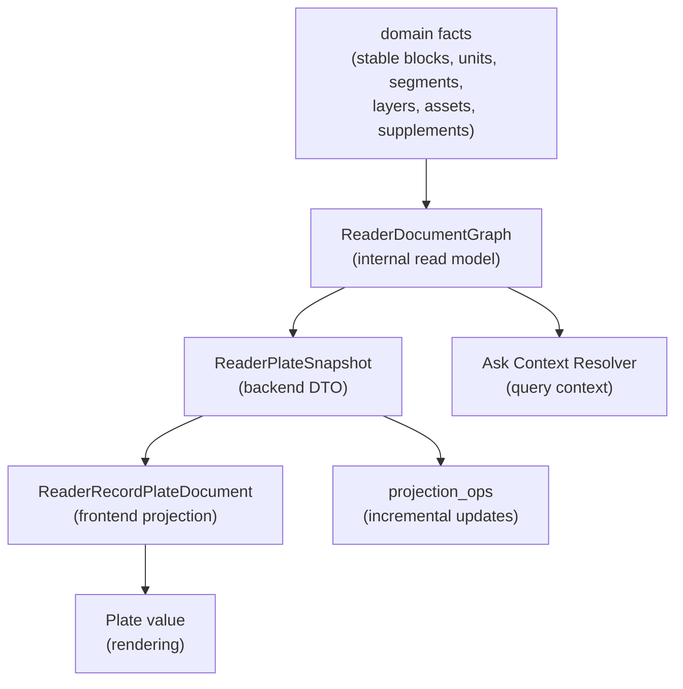

# ReaderDocumentGraph 方案评审

> 评审对象：[TMP-reader-document-graph-design-2026-06-27.md](file:///c:/Users/nanpr/claread/claread/docs/tmp/reader-orchestration/TMP-reader-document-graph-design-2026-06-27.md)
> 评审基准：[reading-base-and-units.md](file:///c:/Users/nanpr/claread/claread/docs/initiatives/reader-agentic-orchestration/modules/reading-base-and-units.md)、[plate-reader-projection.md](file:///c:/Users/nanpr/claread/claread/docs/initiatives/reader-agentic-orchestration/modules/plate-reader-projection.md)、[enhancement-layers-and-parsed.md](file:///c:/Users/nanpr/claread/claread/docs/initiatives/reader-agentic-orchestration/modules/enhancement-layers-and-parsed.md)、[reader-record-plate-surface-ui.md](file:///c:/Users/nanpr/claread/claread/docs/initiatives/reader-agentic-orchestration/modules/reader-record-plate-surface-ui.md)、[reader-plate-component-integration.md](file:///c:/Users/nanpr/claread/claread/docs/initiatives/reader-agentic-orchestration/modules/reader-plate-component-integration.md)、[streaming-and-projection.md](file:///c:/Users/nanpr/claread/claread/docs/initiatives/reader-agentic-orchestration/modules/streaming-and-projection.md)、[concepts.md](file:///c:/Users/nanpr/claread/claread/docs/initiatives/reader-agentic-orchestration/concepts.md)
> 评审日期：2026-06-27

---

## 总体判断：有条件接受

方案方向正确——在 stable truth 与 Plate renderer 之间补一层产品语义模型是必要的架构演进。但 TMP 草案在若干关键处与既有正式文档存在**口径冲突、角色重叠和粒度缺失**，如果不解决就落地，会导致 Graph 与现有 `ReaderPlateSnapshot` / `ReaderRecordPlateDocument` / `projection_ops` 体系产生双轨竞争。

接受条件：下方 TOP 5 风险中至少 #1 #2 #3 必须在沉淀到正式文档前解决；#4 #5 可在 Phase 1 实施中迭代验证。

---

## 最大风险 TOP 5

### 1. 与 `ReaderPlateSnapshot` / `ReaderRecordPlateDocument` 的角色冲突（**最高优先级**）

> [!CAUTION]
> 正式文档已定义了完整的 projection pipeline：`ReaderPlateSnapshot`（后端 DTO）→ `ReaderRecordPlateDocument`（前端 projection schema）→ Plate value。TMP 草案新增 `ReaderDocumentGraph` 却没有说明它与这两者的关系。

**具体冲突点：**

| TMP 草案说法 | 正式文档已有 | 冲突 |
|---|---|---|
| "ReaderDocumentGraph 汇成可见文档语义，成为 Plate Surface 和 Ask Context 的共同输入" | `ReaderPlateSnapshot` 已经是后端对前端的唯一投影 DTO（[plate-reader-projection.md](file:///c:/Users/nanpr/claread/claread/docs/initiatives/reader-agentic-orchestration/modules/plate-reader-projection.md) L84-L118） | Graph 是 Snapshot 之前的后端内部 read model？还是替代 Snapshot？还是替代前端 `ReaderRecordPlateDocument`？未定义 |
| `ReaderDocumentNode.order: string` | `ReaderPlateSnapshot.navigation.units[].order_index: number` + Plate children 自然序 | 引入字符串 order 与现有数字 order_index 冲突 |
| `ReaderDocumentNode.display_policy: Record<string, unknown>` | 正式文档的 mode / display 由 `ReaderRecordPlateDocument` projection + 沉浸/精读模式 policy 控制 | display policy 归属不明 |

**建议修改方向：**
- 明确 Graph 是 `ReaderPlateSnapshot` 的**上游生成源**，而不是并列物。Pipeline 应为 `domain facts → ReaderDocumentGraph → ReaderPlateSnapshot → ReaderRecordPlateDocument → Plate value`。
- 或者 Graph 取代 Snapshot 成为新的 DTO，但必须说明迁移路径和 event/sequence/recovery contract 的继承关系。
- 绝不能出现 Snapshot 和 Graph 同时存在但不互引的局面。

---

### 2. Translation V2 的 `display_groups` 与正式文档 V2 设计存在分歧

> [!WARNING]
> TMP 草案定义 Translation V2 = `segment_items` + `display_groups`，后者由 worker 输出。但 [reader-record-plate-surface-ui.md](file:///c:/Users/nanpr/claread/claread/docs/initiatives/reader-agentic-orchestration/modules/reader-record-plate-surface-ui.md) L593-L617 已有 Translation V2 设计：worker 输出 per-`anchor_segment_id` items，**前端**再合并为 translation pair groups。

**核心分歧：display_groups 由谁生成？**

| TMP 草案 | 正式文档 |
|---|---|
| Worker 输出 `display_groups`，含 `placement_reason` | Worker 输出 per-segment items，前端做 1-3 segment group 合并 |
| Group 有 `group_id`，持久存储在 Translation V2 schema | 前端 projection 临时生成 |

**分析：**
- TMP 草案的 worker-side grouping 有合理性：分组不纯是 CSS 问题，需要语义判断（grammar break、long sentence、quote boundary）。但这把 **排版决策放入 LLM 输出**，增加 prompt 复杂度和 validation 难度。
- 正式文档的 client-side grouping 更简单，但缺乏语义分组能力，可能退化为机械式 1-3 句合并。

**建议修改方向：**
- 采用折中方案：Worker 输出 `segment_items`（必须）+ 可选 `grouping_hints`（建议）。`grouping_hints` 不是 display truth——前端 projection 基于 hints + deterministic rules 生成最终 groups。
- `display_groups` 不应有 `group_id`，不应进入持久 schema。它是 projection 阶段的派生物，与 `display_policy` 一样不是 domain truth。
- 这样既保留 LLM 的语义判断能力，又不把排版绑死在 worker output。

---

### 3. `ProjectionAnchor` 与 `UserEditorialAssetAnchor` 的重叠和 rebase 风险

> [!WARNING]
> 正式文档 ([reader-record-plate-surface-ui.md](file:///c:/Users/nanpr/claread/claread/docs/initiatives/reader-agentic-orchestration/modules/reader-record-plate-surface-ui.md) L91, [reading-base-and-units.md](file:///c:/Users/nanpr/claread/claread/docs/initiatives/reader-agentic-orchestration/modules/reading-base-and-units.md) L91) 已定义 `UserEditorialAssetAnchor`，使用 `record_id` + `base_id` + `generation` + `unit_id` + `anchor_segment_id` + unit-local offsets + `text_hash`。TMP 草案新增 `ProjectionAnchor`，扩展了 `scope` 和 `graph_version`。

**风险点：**

| Scope | Anchor 稳定性 | Rebase 风险 |
|---|---|---|
| `stable_source` | 高——与现有 `UserEditorialAssetAnchor` 等价 | 低 |
| `translation` | 中——translation regenerate 后 text 变化 | **高**：用户选中译文"这里的翻译不准"，regenerate 后 offset 失效 |
| `system_ai_layer` | 低——grammar/vocabulary regenerate 后 note text 变化 | **极高**：用户在 grammar note 上写笔记，layer regenerate 后锚点丢失 |
| `ask_supplement` | 中——supplement 可被删除 | 中等 |
| `user_note` | 高——用户控制生命周期 | 低 |

**关键问题：**
- TMP 草案回避了 rebase 策略。当 translation layer regenerate 后，基于旧 translation text 的 `ProjectionAnchor` 如何处理？`graph_version` 能否自动 rebase？
- 正式文档明确 "Highlight 先仅支持 stable_source"，TMP 草案同意但未给出 non-source scope 的 note rebase 策略。

**建议修改方向：**
- Ask 的 `translation` / `system_ai_layer` scope anchor 应该是 **ephemeral context reference**，用于构建问句上下文，但不持久化为用户资产锚点。
- Note 写入 non-source scope 时，必须同时记录 `origin_ref` 到 source anchor（TMP 草案已有此字段），并明确：layer regenerate 后，note 退回到 source anchor 重新定位，译文/解析文本变化时 note 显示"参考内容已更新"提示。
- 不要试图做 general-purpose text rebase。

---

### 4. `ReaderDocumentGraph` 作为中间层的必要性 vs. 过度复杂性

**分析：当前问题是否需要新的 Graph 抽象？**

当前页面"像卡片不像文档"的根本原因：
1. Unit-level 译文只能作为整段 blockquote 插入（这是 TranslationLayerOutput V1 限制）
2. `sentence_analysis` 被投影为文档流 callout block 而非 cue（代码未跟上设计文档）
3. Grammar note 也被投影为 callout
4. 原文缺少 Stable Document Blocks 的文档结构

其中 #1 需要 Translation V2（不管有没有 Graph 都需要），#2 和 #3 是 projection 逻辑问题（修改现有 `projectReaderPlateSnapshotToReaderRecordPlateDocument` 即可），#4 需要 Input Adapter + Stable Document Blocks（已在 D6 计划中）。

> [!IMPORTANT]
> **Graph 的真正价值不在于解决现有 UI 问题，而在于给 Ask Claread 一个与 Plate 文档一致的上下文视图。** 没有 Graph，Ask 需要从 layer/unit/segment 自己拼接上下文，与用户所见不一致。这一价值是真实的——但文档应把论证重心从"文档不像文档"转到"Ask context consistency"。

**建议修改方向：**
- 把 Graph 定位为 **后端 snapshot assembler 的内部模型**，不暴露为新的 API contract。外部 contract 仍然是 `ReaderPlateSnapshot`（或其演进），Graph 是组装 Snapshot 的中间步骤。
- 避免让前端直接消费 `ReaderDocumentGraph` 节点——前端继续消费 `ReaderRecordPlateDocument`。
- 这样 Graph 的复杂性被封装在后端，不泄漏到 client。

---

### 5. 长文性能和渐进式 orchestration 的实际路径不清

TMP 草案提到"按 block/window lazy projection，snapshot cache，viewport-aware load"但没有说明：

- Graph 节点数量级：一篇 50 个 unit × 每 unit 平均 5 segment × 4 layer types = ~1000 个 node。长文（100+ unit）可达数千 node。Graph 全量重建和序列化的延迟？
- 与现有 `ReaderPlateSnapshot` full reload 的性能差异：当前 D4 使用实时聚合，Graph 增加了一个中间聚合步骤。
- Viewport-aware load 与 `reader_events` sequence-based recovery 的兼容性：如果只 load 可见范围，`last_event_sequence` 如何管理？

**建议修改方向：**
- Phase 1 的 Graph 必须是可以完全在 snapshot assembler 内部计算的，不引入新的持久化。
- 明确 Graph 的性能预算：首屏延迟 < 500ms（50 unit 文档），Graph 重建 < 200ms。
- Viewport windowing 推迟到 Phase 3+，与 `projection_ops` incremental applier 一起设计。

---

## 需要补充或改写的设计点

### A. 与现有 pipeline 的精确集成点

TMP 草案缺少一张图来说明 Graph 如何嵌入现有 pipeline：

这张图需要在正式文档中明确。

### B. `ReaderDocumentNode` 与现有 Plate node types 的映射表

TMP 草案定义了 11 种 `node_type`，但正式文档已有详细的 Plate element/leaf types（`reader_unit`, `reader_source_block`, `reader_anchor_segment`, `reader_record_unit_translation`, `reader_record_grammar_cue`, `reader_record_sentence_analysis_cue` 等）。缺少 Graph node type → Plate element type 的映射表。

### C. `sentence_analysis` 的展示决策

TMP 草案写 "默认是 Structure Lens cue"。正式文档也写 "V1 只投影为 cue"。但 [reader-plate-component-integration.md](file:///c:/Users/nanpr/claread/claread/docs/initiatives/reader-agentic-orchestration/modules/reader-plate-component-integration.md) L53 明确写 "当前代码仍投影为 callout"。

**需要做的决策：** 先改代码到 cue-only（与文档对齐），还是先在 Graph 中定义 cue + expandable callout 的两层形态？建议前者——先让代码和文档一致，再在 Graph 中建模交互扩展。

### D. Vocabulary marks 的 Graph 建模

TMP 草案把 vocabulary 定义为 `vocabulary_mark` node type。但正式文档中 vocabulary 不是 block-level node——它是 stable source leaf 上的 inline AI mark。Graph 中 vocabulary 应该是 **mark on source node**，不是独立 node，否则会破坏 inline mark 的叠层模型。

### E. `order: string` 的排序策略

TMP 草案用 `order: string` 但未定义排序算法。正式文档用 `order_index: number`。建议：
- Source nodes 使用 Stable Document Block order + Anchor Segment order（已有数字 index）。
- Enhancement nodes 使用 `after: anchor_segment_id` 或 `after: block_id` + deterministic sub-order。
- 不引入任意字符串排序（如 fractional indexing），在当前场景过度。

### F. Ask Context Resolver 的输入/输出 contract

TMP 草案描述了 Resolver 应返回的内容（L282-L291），但没有给出 TypeScript/Python 类型签名。这是 Graph 价值的核心交付物，不应留空。

---

## 建议保留的设计点

### ✅ 1. "Plate.js 不是业务事实源"的强化

TMP 草案的非目标清单精准，与正式文档高度一致。特别是"不持久化 raw Plate JSON""不让 LLM 直接输出可持久化的 arbitrary Plate JSON"。

### ✅ 2. Translation V2 的 `segment_items` 方向

Per-segment 对齐是正确演进。正式文档 V2 也是这个方向。应保留。

### ✅ 3. 渐进迁移路线 Phase 0-5

五阶段路线合理：先收敛术语，再 Graph V1，再 Translation V2，再 ProjectionAnchor 扩展，再 Plate component 收敛，最后 AI suggestion。顺序正确。

### ✅ 4. "Graph 可重建、cache 可丢弃"的存储原则

与正式文档的 "Snapshot is rebuilt from domain facts" 原则一致。明确 truth 仍在 stable blocks + canonical text + layers。

### ✅ 5. ProjectionAnchor 对 Ask 的多 scope 支持

Ask 需要能回答"这段译文为什么这么翻""这个语法解释是什么意思"——这需要跨 scope anchor。只要 note/highlight 的写入策略做好（见 TOP 5 #3），Ask 的读取 scope 可以更宽。

### ✅ 6. Grammar/Sentence Analysis 投影分离

"grammar_note 是 inline cue + note；sentence_analysis 是 Structure Lens cue"——与正式文档一致，且比当前代码（都是 callout）更符合文档感设计。

---

## 下一轮 Grill 决策问题

### Q1. Graph 的对外边界

> ReaderDocumentGraph 是后端 snapshot assembler 的**内部中间模型**，还是成为新的 **API contract** 直接发给前端？

如果是前者，它的价值主要在 Ask context resolver 和 snapshot 组装的统一性；如果是后者，需要与 `ReaderPlateSnapshot` 做合并或替代设计。

### Q2. Translation display grouping 的决策权

> Display groups 由 **worker LLM 决定**（TMP 草案），由**前端 deterministic rules 决定**（正式文档 V2），还是 **worker 建议 + 前端决定**（评审建议的折中方案）？

这直接影响 Translation V2 schema 设计和 worker prompt 复杂度。

### Q3. Non-source scope 的 note 写入是否立即开放

> V1 Note 支持 non-source scope 写入（TMP 推荐），还是 V1 Note 仍然只允许 stable_source scope 写入（与 Highlight 对齐）？

如果开放，需要先解决 rebase 策略。如果不开放，Ask 仍然只能在 session 内跨 scope 引用，不能持久保存非 source 的 note anchor。

### Q4. 现有 `ReaderRecordPlateDocument` 的命运

> 已有 `ReaderRecordPlateDocument` 前端 projection schema 是**继续保留**（Graph 只影响后端），还是**被 Graph 前端投影替代**？

如果保留，前端 projection helper `projectReaderPlateSnapshotToReaderRecordPlateDocument` 继续存在，Graph 变化对前端透明。如果替代，需要重写前端 projection 和所有 characterization tests。

### Q5. Phase 1 的验证标准

> Phase 1 "Graph Projection V1" 的 **done condition** 是什么？

建议最小标准：
- 同一篇文章的 Plate 文档与 Ask context 使用同一 Graph 组装。
- Graph 可从 domain facts 在 < 200ms 内重建（50 unit 文档）。
- 不引入新的持久化表。
- 不改变现有 `ReaderPlateSnapshot` 的外部 contract。

### Q6. Vocabulary 在 Graph 中的建模形态

> Vocabulary items 是 Graph 中的 **independent nodes**（TMP 草案），还是 **marks on source nodes**（正式文档 projection schema）？

这影响 Graph 的节点规模和 mark conflict resolver 的位置。

### Q7. 长文 windowed Graph 的启动条件

> 如果长文 Graph 全量重建超过性能预算，是先做 **Graph cache/materialization**，还是先做 **viewport-aware partial graph**？

前者更简单但增加存储复杂度；后者更优雅但需要 partial recovery 策略。

---

## 附：反例与边界场景

| # | 场景 | 风险 |
|---|---|---|
| 1 | 用户在译文上选中一段，写了 note "这里翻得不好"。Translation regenerate 后译文变化。 | Note 的 `ProjectionAnchor(scope=translation)` offset 失效。用户 note 丢失或乱位。 |
| 2 | 50 unit 文章，用户打开精读模式，所有 layer 都已 published。 | Graph 节点数 = ~50 source blocks + ~250 segments + ~50 translations + ~200 vocab marks + ~30 grammar notes + ~15 sentence analyses ≈ 600 nodes。序列化和 Plate value 生成的延迟？ |
| 3 | Unit 内有 3 个 sentence，但 Translation V2 worker 只输出 1 个 display group 覆盖全 unit。 | 与 V1 unit-level translation 无实质差异。需要 validation rule 限制 group 覆盖比例。 |
| 4 | Ask 回答基于 grammar note 文本。Grammar note layer regenerate 后 note text 变化。用户再问 "你刚才说的那个语法点"。 | Ask context resolver 引用的 Graph node 已过期。需要 Ask 对话历史中的 citation 带 generation/layer_id 做 stale 检测。 |
| 5 | Mobile/跨端使用 Graph：iOS native 不用 Plate.js。 | Graph 如果包含 Plate-specific 信息（如 display_policy），跨端需要再做一次 projection。Graph 应该是 renderer-neutral。 |
| 6 | 用户在 `fallback_window` segment 上的 source 文本上写 highlight。 | 正式文档说 `fallback_window` 不产出 layer item，但 `stable_source` highlight 应该仍然允许。ProjectionAnchor 对 `fallback_window` 需要额外校验逻辑。 |
| 7 | `sentence_analysis` 默认 cue-only，但部分复杂句需要自动展开。 | "自动展开"的触发条件是什么？LLM 标记 `complexity: high`？前端 heuristic？需要明确，否则所有 analysis 要么全 cue 要么全 callout。 |
