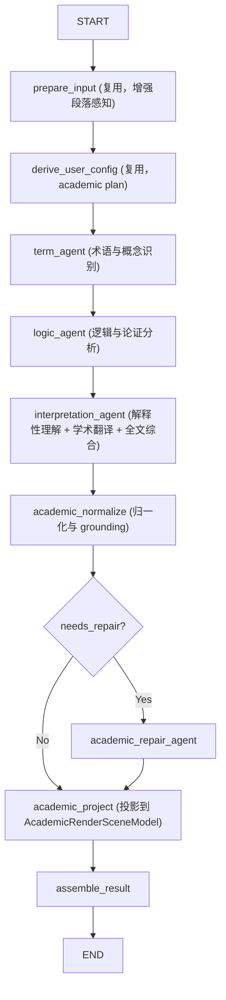

## 1. 研究目的

本文档从学术英语（English for Academic Purposes, EAP）阅读、认知负荷理论（Cognitive Load Theory）以及学术语篇分析（Discourse Analysis）的角度，分析 `academic` 模式的特征与用户需求。

与 `daily_reading` 和 `exam` 模式不同，`academic` 模式的用户目标是**“透读英文文献、获取学术知识”**，而非“学习英语语言本身”。本文档旨在为该模式的 Agent 节点、输出 Schema、Prompt 设计以及前端渲染提供学理依据和策略指导。

**阅读说明**：
- 第 1-6 节是研究依据和产品洞察，用于解释 academic 模式为什么这样设计
- 第 7-11 节是历史设计探索和问题分析，不构成 v1 实现规范
- **第 12 节是 academic v1 的唯一实现规范**；若与前文冲突，一律以第 12 节为准

---

## 2. 学术阅读的认知负荷特征 (Cognitive Load in L2 Academic Reading)

在阅读高度专业化的英语文献时，L2（第二语言）读者的工作记忆（Working Memory）面临巨大挑战。

### 2.1 认知负荷理论的应用
根据认知负荷理论，L2 学术阅读的负荷主要来源于：
- **内在负荷 (Intrinsic Load)**：学术文本本身的高信息密度、复杂的逻辑关系以及高难度的专业概念。
- **外在负荷 (Extraneous Load)**：由不佳的阅读方式（如频繁查阅外部词典导致的“注意力分散效应 Split-Attention Effect”，或在脑内进行低效的“字对字”心译）产生的无效脑力消耗。

### 2.2 应对策略：从“教学”转向“辅助”
对于学术阅读，AI 的核心目标应当是**降低外在负荷，辅助处理内在负荷**：
- **不教基础语法**：分析定语从句或虚拟语气会额外增加用户的认知负担（Extraneous Load）。用户需要的是直接看懂内容，而不是复习语法规则。
- **提供认知脚手架 (Scaffolding)**：通过精准的专业翻译、概念释义和逻辑梳理，帮助用户跨越语言障碍，直接触达学术思想。

---

## 3. 学术文本的核心语言与语篇特征

学术英语具有极其鲜明的文体特征，这也是 L2 读者理解的主要障碍点。

### 3.1 词汇特征 (Lexical Features)
- **专业术语 (Technical Vocabulary/Jargon)**：特定领域的专属词汇，具有单一且明确的含义。
- **半技术词汇 (Sub-technical Vocabulary)**：在日常英语中有常见含义，但在学术语境下具有特殊含义的词（例如：`literature` 指“文献”而非“文学”，`significance` 指“统计学显著”而非“重要”，`model` 指“理论模型”）。这是 L2 读者最容易产生误解的地方。
- **高频学术词汇 (Academic Word List, AWL)**：跨学科广泛使用的正式词汇（如 `analyze`, `derive`, `methodology`）。

### 3.2 句法与修辞特征 (Syntactic & Rhetorical Features)
- **名词化 (Nominalization)**：学术文本倾向于将动词或形容词转化为名词（例如将 `we measured the data` 变为 `the measurement of the data`），以打包更多信息并保持客观性。这会导致句子中“谁做了什么”的动作主体变得模糊。
- **被动语态 (Passive Voice)**：用于凸显研究客体，隐藏研究者主观色彩。
- **模糊限制语 (Hedging)**：学术表达极其严谨，大量使用 `suggest`, `indicate`, `might`, `could possibly` 等词来表达论断的确定性程度（Epistemic Modality）。忽略 Hedging 会导致对作者主张的误读。

### 3.3 语篇宏观结构 (Discourse Structure)
- **IMRAD 结构**：标准的实证研究论文结构（Introduction, Methods, Results, and Discussion）。
- **CARS 模型 (Create A Research Space)**：由 Swales 提出，学术论文引言通常遵循“确立研究领域 -> 寻找研究空白 (Gap) -> 占据研究空白”的修辞步骤。高级读者在阅读时会主动寻找这些“语步 (Moves)”。

---

## 4. Academic 模式的深度解析与翻译策略

基于上述分析，`academic` 模式的 AI 行为逻辑应发生根本性转变：**从“英语老师”转变为“学术助教/科研导读”。**

### 4.1 翻译策略：专业、精准、客观
| 维度 | Academic 模式翻译要求 | 对比 Daily/Exam 模式 |
| --- | --- | --- |
| **定位** | 核心信息获取通道，消除注意力分散 | 理解验证工具 / 考试对照 |
| **术语处理** | 必须使用该学科通用的标准中文术语，绝不能生造或直译 | 允许一定的通俗化解释 |
| **文风语调** | 客观、严谨、书面化，保留学术文本的“非个人化”特征 | 自然、地道、通俗 |
| **长难句处理** | 优先还原逻辑关系，可适当拆句，但必须保留原句的严谨限制条件 | 追求句式结构的贴近或通顺 |

### 4.2 深度解析的关注点 (Focus of In-depth Analysis)
在 `academic` 模式中，AI 的解析内容（Analysis / Explanations）应聚焦于以下三个层面：

1. **核心学术概念释义 (Concept Explication)**
   - 不再解析普通词汇，专门针对术语（Technical）和半技术词汇（Sub-technical）进行深度背景知识补充。
   - 解释该概念在本篇文献语境中的具体含义，而非词典上的通用解释。

2. **论点与修辞解析 (Argument & Hedging Analysis)**
   - 重点提取和解析作者的**核心主张 (Claims)** 和**研究假设 (Hypotheses)**。
   - 标注并解释**模糊限制语 (Hedging)**，例如指出“作者在这里使用 *may imply* 是为了对结论保持谨慎”。
   - 梳理复杂的逻辑推演过程（如因果关系、对比转折）。

3. **语篇逻辑导航 (Discourse Navigation)**
   - 帮助用户快速定位论文的关键结构：研究动机 (Motivation)、研究空白 (Research Gap)、核心方法 (Methodology)、主要发现 (Key Findings) 和局限性 (Limitations)。
   - 解析不应停留在句子层面，而应上升到段落和篇章层面（例如：“这一段的主要作用是回顾前人研究并指出其不足”）。

### 4.3 应当摒弃的常规做法
- **完全放弃基础语法讲解**：绝不输出“这里是定语从句修饰先行词”、“这是一个现在分词作状语”等传统的英语教学内容。如果句子结构复杂导致难以理解，直接通过**逻辑切分**或**意群翻译**来解决，而不是讲语法规则。
- **放弃通用词汇表提取**：不需要提取四六级、考研等大纲词汇。

---

## 5. 综合画像：`academic` (学术透读模式)

**核心特征**：极高的信息密度与专业壁垒；读者认知负荷大；阅读目标明确（为科研或专业工作获取信息）。

**AI 讲解策略总方向**：
- **词汇**：**只打“硬骨头”**——忽略常规词汇，死磕专业术语、半技术词汇和缩写，提供百科百科式的背景释义。
- **语法**：**零显性语法，全逻辑拆解**——用逻辑关系（因果、条件、让步）替代语法术语（从句、虚拟语态）。
- **翻译**：**研究阅读级准确翻译**——用词严谨客观，优先 faithful，保留 hedging 与限定条件，是用户获取信息的第一信源。
- **语篇**：**宏观结构透视**——主动帮用户提炼 Gap、Method、Conclusion，识别学术修辞（Hedging）。

**用户心理预期**："我不需要你教我英语，我需要你帮我快速、准确地吃透这篇顶会的 Abstract/Method，不要让我因为专业词汇和绕口的学术长句而卡壳。"

---

## 6. 业界学术阅读工具调研

为确定 academic 模式的 Schema、Workflow 与前端渲染方案，我们对当前主流学术阅读辅助工具进行了调研，提取可借鉴的设计模式。

### 6.1 Scim — 智能分面高亮 (Intelligent Faceted Highlights)

**来源**：Allen AI / University of Washington，发表于 CHI 2025（[Fok et al., 2025](https://andrewhead.info/assets/pdf/scim.pdf)）

**核心设计**：
- 自动识别论文中的关键句子，按**修辞面 (Rhetorical Facets)** 分类高亮，包括：
  - **Purpose**：研究目的
  - **Method**：方法描述
  - **Result**：实验结果
  - **Implication**：推论与意义
- 高亮密度可由用户调节（sparse / moderate / dense）
- 高亮在论文全文中**均匀分布**，避免集中在前几段
- 侧边栏提供按 facet 分组的高亮摘要浏览器，用户可点击直接跳转

**可借鉴点**：
- **分面标注 (Faceted Annotation)** 是学术阅读的核心交互范式——用户不是"看所有标注"，而是"按需筛选某一类信息"
- 均匀分布原则：避免标注只集中在开头几段，确保全文覆盖
- 侧边栏摘要浏览器：提供"非线性阅读"入口

### 6.2 Semantic Reader — 增强型学术阅读器

**来源**：Allen AI / Semantic Scholar（[Lo et al., 2023](https://arxiv.org/pdf/2303.14334)）

**核心设计**：
- **Paper Cards**：点击行内引用标记时，弹出引用论文的摘要卡片，无需离开当前阅读
- **Scim 高亮集成**：将 Scim 的分面高亮嵌入阅读器
- **Scope Maps**：论文结构导航，快速定位各章节
- **Inline Definitions**：术语和符号的行内定义提示（tooltips）
- **Citation Context**：展示某论文被引用时的上下文

**可借鉴点**：
- **行内定义 (Inline Definitions)**：对术语提供即时的悬浮解释，减少注意力分散
- **结构导航 (Scope Maps)**：论文级结构概览，帮助用户建立全局认知
- **上下文增强**：不只是标注，而是提供"为什么这里提到这个概念"的解释

### 6.3 Scholaread (靠岸学术) — 非线性学术阅读

**来源**：商业产品，面向中文科研用户

**核心设计**：
- **AI 智能高亮**：自动识别研究目的、实验方法、创新点、结论等关键模块，用不同颜色高亮
- **非线性阅读**：用户无需逐字通读，可直接跳转到感兴趣的结构模块
- **逐段对照翻译**：原文与译文逐段对齐，支持划词翻译
- **AI 深度问答**：支持"梳理研究时间线"、"对比创新点与传统方法"等结构化问答
- **图表/公式智能解析**：识别三线表、热图、流程图等 30+ 类型，生成可视化解读
- **Reflow 重排**：将双栏 PDF 转为流式布局，适配移动端

**可借鉴点**：
- **结构化模块识别**：将论文内容按功能模块（目的/方法/结果/结论）分类，是学术阅读的核心需求
- **颜色编码系统**：不同类型信息用不同颜色区分（定义=黄色、论点=蓝色、证据=绿色）
- **翻译对照**：逐段对齐是学术翻译的最佳呈现方式

### 6.4 Textarium — 标注、抽象与论证的可视化

**来源**：学术研究项目（[arXiv:2509.13191](https://arxiv.org/pdf/2509.13191v1)）

**核心设计**：
- 读者可高亮文本、将关键词分组为概念 (Concepts)、将观察嵌入为锚点
- 将解读行为参数化为可视化状态
- 桥接"细读 (Close Reading)"与"远读 (Distant Reading)"

**可借鉴点**：
- **概念聚合**：将分散的术语标注聚合为"概念组"，帮助用户建立术语网络
- **参数化可视化**：标注不只是静态标记，而是可交互的参数化状态

### 6.5 CommentScope — 评论嵌入式辅助阅读

**来源**：学术研究项目（[arXiv:2512.06408](https://www.arxiv.org/pdf/2512.06408)）

**核心设计**：
- 将在线评论与文章文本直接集成
- 后端语义处理 + 前端可视化
- 行内评论、句尾饼图、高频词高亮等多种视图切换

**可借鉴点**：
- **多视图切换**：同一内容提供不同粒度的呈现方式
- **句尾聚合**：在句子末尾聚合该句相关的所有分析信息

### 6.6 调研总结：核心设计模式提取

| 设计模式 | 来源工具 | 对 academic 模式的适用性 |
| --- | --- | --- |
| 分面标注 (Faceted Annotation) | Scim | **核心**：按术语/逻辑/结构/解释分类 |
| 行内定义 (Inline Definitions) | Semantic Reader | **高**：术语悬浮解释 |
| 结构导航 (Scope Maps) | Semantic Reader | **高**：段落功能标签 |
| 颜色编码 (Color Coding) | Scholaread, Readest | **高**：不同标注类型用不同颜色 |
| 逐段对照翻译 | Scholaread | **核心**：学术翻译的第一呈现方式 |
| 概念聚合 (Concept Grouping) | Textarium | **中**：v2 可考虑 |
| 多视图切换 | CommentScope | **中**：v1 简化，v2 扩展 |

---

## 7. Academic Schema 设计方案（初版，已被第 12 节收口方案取代）

> ⚠️ **本节为初版设计探索，已被第 12 节的 v1 收口方案取代。** 以下 schema 仅保留作为设计思路参考，**v1 实现以第 12 节为准**。本节中的 TermNote / LogicNote / InterpretationDraft / AcademicNormalizedResult / AcademicGoalPolicy / AcademicRenderSceneModel 均不再作为 v1 规范。

### 7.1 设计原则

基于第 2-5 节的学理分析和第 6 节的调研，academic schema 设计遵循以下原则：

1. **独立建模**：academic 不复用 learning 的 `VocabularyDraft + GrammarDraft + TranslationDraft` 三分法，而是围绕"内容理解"重新组织
2. **语义优先**：标注类型的命名和结构反映学术阅读的认知目标，而非语言教学目标
3. **段落级粒度**：academic 的部分标注（段落角色、论证结构）天然是段落级的，不能强行降为句级
4. **渐进式扩展**：v1 只做最小闭环，但 schema 预留扩展空间

### 7.2 Draft Schema 设计

academic 模式的 agent 产出应组织为以下三类 draft：

#### 7.2.1 TermDraft — 术语与概念标注

```python
class TermNote(BaseModel):
    """术语/概念标注。"""
    type: Literal["term_note"] = "term_note"
    sentence_id: str
    text: str                          # 原文中的术语或概念表达
    occurrence: int | None = None
    term_category: Literal[
        "technical",       # 专业术语（如 GAN, BERT, CRISPR）
        "sub_technical",   # 半技术词汇（如 literature=文献, significance=统计显著）
        "abbreviation",    # 缩写（如 NLP, CNN, RCT）
        "variable",        # 变量/符号（如 x̄, α, F1-score）
        "concept_opposition",  # 概念对立（如 nature vs. nurture）
    ]
    zh: str                             # 标准中文术语翻译
    context_definition: str             # 在本文语境下的具体含义（非词典通用释义）
    discipline: str | None = None       # 所属学科领域（如 "NLP", "epidemiology"）

class TermDraft(BaseModel):
    term_notes: list[TermNote]
```

**与 learning 模式的关键差异**：
- learning 的 `VocabHighlight` 关注"这个词值不值得学"，`TermNote` 关注"这个术语/概念是否妨碍理解内容"
- `context_definition` 不是词典释义，而是"这个词在这篇论文里具体指什么"
- `term_category` 区分了术语类型，其中 `sub_technical` 是学术阅读最大的陷阱

#### 7.2.2 LogicDraft — 逻辑与论证标注

```python
class LogicNote(BaseModel):
    """逻辑/论证关系标注。"""
    type: Literal["logic_note"] = "logic_note"
    sentence_id: str
    logic_type: Literal[
        "transition",      # 转折（however, nevertheless）
        "concession",      # 让步（although, while）
        "limitation",      # 限定（only, within the scope of）
        "causation",       # 因果（therefore, as a result）
        "contrast",        # 对比（in contrast, whereas）
        "hypothesis",      # 假设（if, assuming that）
        "conclusion",      # 结论（thus, in summary）
        "evidence",        # 证据支撑（as shown in, demonstrated by）
    ]
    anchor_text: str                    # 触发该逻辑关系的原文表达
    occurrence: int | None = None
    explanation: str                    # 对该逻辑关系的解释（非语法术语）
    hedging: bool = False               # 是否包含模糊限制语
    hedging_explanation: str | None = None  # 对 hedging 的解读

class ParagraphRole(BaseModel):
    """段落功能角色标注。"""
    type: Literal["paragraph_role"] = "paragraph_role"
    paragraph_id: str
    role: Literal[
        "background",       # 背景/文献综述
        "problem",          # 问题提出/研究空白
        "objective",        # 研究目标
        "method",           # 方法描述
        "evidence",         # 证据/数据呈现
        "result",           # 结果报告
        "discussion",       # 讨论/解释
        "limitation",       # 局限性声明
        "transition",       # 过渡/衔接
        "conclusion",       # 结论
        "definition",       # 定义/概念引入
    ]
    confidence: float = 1.0             # 角色判定的置信度
    summary: str                        # 该段落的一句话功能摘要

class LogicDraft(BaseModel):
    logic_notes: list[LogicNote]
    paragraph_roles: list[ParagraphRole]
```

**与 learning 模式的关键差异**：
- learning 的 `GrammarNote` 用语法术语解释句子结构，`LogicNote` 用逻辑关系解释句间/句内推理
- `ParagraphRole` 是段落级标注，这是 learning 模式完全没有的粒度
- `hedging` 和 `hedging_explanation` 直接对应学术阅读中"作者到底有多确定"这个核心问题

**段落角色的分类依据**：
- 基于 IMRAD 结构和 CARS 模型（第 3.3 节）
- 参考 RCMR 语料库的 Move 分类体系（[MIT Press, 2023](https://direct.mit.edu/dint/article/doi/10.1162/dint_a_00214/115770/RCMR-280k-Refined-Corpus-for-Move-Recognition)），该语料库将学术摘要句子分为 Purpose / Design/Methodology/Approach / Findings / Originality/value / Social implication / Practical implications / Research limitations/implications 等类别
- v1 范围内，`ParagraphRole` 的枚举值覆盖了 IMRAD + CARS 的核心语步

#### 7.2.3 InterpretationDraft — 解释性理解与翻译

```python
class InterpretationNote(BaseModel):
    """解释性理解标注。"""
    type: Literal["interpretation_note"] = "interpretation_note"
    sentence_id: str
    interpretation: str                 # "这句话真正想表达什么"的解释性改写
    literal_trap: str | None = None     # 为什么不能只按字面直译理解（可选）
    key_implication: str | None = None  # 该句对全文论证的关键贡献（可选）

class AcademicTranslation(BaseModel):
    """学术翻译。"""
    sentence_id: str
    translation_zh: str                 # 出版级学术中文翻译
    translation_notes: list[str] = []   # 翻译决策说明（如术语选择理由）

class DocumentSummary(BaseModel):
    """全文综合摘要。"""
    research_question: str | None = None    # 研究问题
    methodology: str | None = None          # 核心方法
    key_findings: list[str] = []            # 主要发现
    limitations: list[str] = []             # 局限性
    contribution: str | None = None         # 核心贡献

class InterpretationDraft(BaseModel):
    interpretation_notes: list[InterpretationNote]
    sentence_translations: list[AcademicTranslation]
    document_summary: DocumentSummary | None = None
```

**与 learning 模式的关键差异**：
- learning 的 `TranslationDraft` 追求"自然顺畅"，`AcademicTranslation` 追求"严谨客观"
- `InterpretationNote` 是 academic 独有的标注类型，解释"作者真正想表达什么"
- `literal_trap` 直接解决"半技术词汇误导"问题（如 significance 不等于"重要"）
- `DocumentSummary` 提供论文级综合视角，这是 learning 模式不需要的

### 7.3 Normalized Schema 设计

academic 的 normalized 结果应组织为：

```python
class AcademicNormalizedResult(BaseModel):
    term_annotations: list[TermNote]
    logic_annotations: list[LogicNote]
    paragraph_roles: list[ParagraphRole]
    interpretation_annotations: list[InterpretationNote]
    sentence_translations: list[AcademicTranslation]
    document_summary: DocumentSummary | None
    drop_log: list[DropLogEntry]
```

normalize 阶段的硬策略应从 `GoalPolicy` 扩展为 `AcademicGoalPolicy`：

```python
class AcademicGoalPolicy(BaseModel):
    term_density: int = Field(ge=1, description="每句最大术语标注数")
    logic_density: int = Field(ge=1, description="每句最大逻辑标注数")
    interpretation_density: int = Field(ge=1, description="每句最大解释标注数")
    require_paragraph_role: bool = True
    require_document_summary: bool = True
    translation_rigor: Literal["strict", "moderate"] = "strict"
```

### 7.4 Render Scene Schema 设计

academic 的渲染场景不应复用 `RenderSceneModel`，而应引入独立的 `AcademicRenderSceneModel`。

**理由**：
1. `RenderSceneModel` 的 `inline_marks` 和 `sentence_entries` 的 `annotation_type` 枚举硬编码为 learning 模式的四种类型（`vocab_highlight`, `phrase_gloss`, `context_gloss`, `grammar_note`），无法表达 academic 的标注类型
2. `RenderSceneModel` 没有 `paragraph_roles` 和 `document_summary` 的位置
3. academic 的前端渲染逻辑与 learning 完全不同，强行共用会导致前端分支爆炸

```python
class AcademicInlineMark(BaseModel):
    id: str
    annotation_type: Literal[
        "term_note",
        "logic_note",
        "interpretation_note",
    ]
    anchor: InlineMarkAnchor
    render_type: InlineMarkRenderType
    visual_tone: Literal["term", "logic", "interpretation"]
    clickable: bool
    lookup_text: str | None = None
    glossary: AcademicInlineGlossary | None = None

class AcademicInlineGlossary(BaseModel):
    zh: str | None = None
    context_definition: str | None = None
    term_category: str | None = None
    logic_type: str | None = None
    hedging: bool = False

class ParagraphRoleMark(BaseModel):
    paragraph_id: str
    role: str
    label: str                          # 前端展示文案（如"方法", "结果"）
    color_tag: str                      # 前端颜色标识
    summary: str

class AcademicSentenceEntry(BaseModel):
    id: str
    sentence_id: str
    entry_type: Literal[
        "term_detail",
        "logic_detail",
        "interpretation_detail",
    ]
    label: str
    title: str | None = None
    content: str

class AcademicRenderSceneModel(BaseModel):
    schema_version: Literal["3.0.0-academic"] = "3.0.0-academic"
    request: AnalyzeRequestMeta
    article: ArticleStructure
    user_facing_state: UserFacingState
    translations: list[TranslationItem]
    inline_marks: list[AcademicInlineMark]
    paragraph_role_marks: list[ParagraphRoleMark]
    sentence_entries: list[AcademicSentenceEntry]
    document_summary: DocumentSummary | None = None
    warnings: list[Warning]
```

---

## 8. Academic Workflow 设计方案（初版，已被第 12 节收口方案取代）

> ⚠️ **本节为初版设计探索，已被第 12 节的两阶段流水线方案取代。** 以下串行三阶段 workflow、AcademicState 定义均不再作为 v1 规范。**v1 实现以第 12.6 节为准。**

### 8.1 设计原则

1. **独立拓扑**：academic graph 不复用 learning graph 的 `prepare_input → derive_user_config → parallel_agents → normalize_and_ground → repair → project → assemble` 主干
2. **串行优先**：academic 的三类 agent 之间存在信息依赖（LogicDraft 需要 TermDraft 的术语上下文；InterpretationDraft 需要前两者的输出），不适合完全并行
3. **段落感知**：academic workflow 必须在 prepare_input 阶段保留段落结构，且后续节点需能访问段落级上下文
4. **渐进式**：v1 先做最小闭环，repair 节点可后置

### 8.2 Academic Graph 拓扑



**与 learning graph 的关键差异**：

| 维度 | Learning Graph | Academic Graph |
| --- | --- | --- |
| Agent 并行性 | 完全并行（vocab/grammar/translation） | 串行流水线（term → logic → interpretation） |
| Agent 数量 | 3 | 3（但职责完全不同） |
| 段落感知 | 句级为主 | 段落级 + 句级 |
| 全文综合 | 无 | 有（document_summary） |
| Repair | 可选 | v1 可选，v2 再定 |
| Projection 目标 | RenderSceneModel | AcademicRenderSceneModel |

### 8.3 串行流水线的合理性

**为什么 academic 不能像 learning 一样并行？**

1. **术语识别是后续分析的基础**：logic_agent 需要知道哪些是术语，才能准确判断论证结构；interpretation_agent 需要术语释义才能做解释性改写
2. **论证分析依赖术语上下文**：例如判断 "this approach significantly outperforms" 中的 "significantly" 是逻辑限定还是统计显著，需要 term_agent 先识别 "significance" 的语境义
3. **解释性理解依赖前两者的输出**：interpretation_agent 的 "这句话真正想表达什么" 需要综合术语含义和逻辑关系

**串行的代价与缓解**：
- 代价：延迟增加（三次 LLM 调用串行）
- 缓解：term_agent 和 logic_agent 的 prompt 可以设计为"轻量快速"，只做识别和分类，不做深度解释；深度解释统一由 interpretation_agent 完成
- v2 可考虑：term + logic 部分并行（如果验证信息依赖不严重）

### 8.4 Academic State 设计

```python
class AcademicState(TypedDict, total=False):
    payload: AnalyzeRequest
    prepared_input: PreparedInput
    goal_execution_plan: GoalExecutionPlan

    term_draft: TermDraft | None
    logic_draft: LogicDraft | None
    interpretation_draft: InterpretationDraft | None

    term_usage: dict[str, object] | None
    logic_usage: dict[str, object] | None
    interpretation_usage: dict[str, object] | None
    repair_usage: dict[str, object] | None
    usage_summary: dict[str, object] | None

    academic_normalized_result: AcademicNormalizedResult | None
    drop_log: list[DropLogEntry]

    repair_request: dict | None

    render_scene: AcademicRenderSceneModel
    warnings: list[Warning]
    processing_warnings: list[Warning]
```

### 8.5 Agent Node 职责定义

#### term_agent
- **输入**：prepared_input + goal_execution_plan
- **输出**：TermDraft
- **职责**：识别文本中的专业术语、半技术词汇、缩写、变量符号、概念对立
- **不做**：逻辑分析、翻译、解释性改写
- **prompt 要点**：只标注"如果不懂这个词/概念，就无法理解这句话"的表达；普通词汇不标

#### logic_agent
- **输入**：prepared_input + goal_execution_plan + TermDraft
- **输出**：LogicDraft
- **职责**：识别逻辑关系（转折/让步/因果/对比等）、标注 hedging、判定段落功能角色
- **不做**：术语释义、翻译、解释性改写
- **prompt 要点**：重点关注"作者的论证怎么推进"、"哪里在限定结论的适用范围"

#### interpretation_agent
- **输入**：prepared_input + goal_execution_plan + TermDraft + LogicDraft
- **输出**：InterpretationDraft
- **职责**：对关键句做解释性改写、标注直译陷阱、产出学术翻译、生成全文综合摘要
- **不做**：术语识别、逻辑分类
- **prompt 要点**：翻译追求"出版级学术中文"；解释追求"帮用户确认作者到底在说什么"

---

## 9. 前端渲染设计方案（初版，已被第 12.7 节收口方案取代）

> ⚠️ **本节为初版设计探索，已被第 12.7 节的收口方案取代。** 以下结构导航条、摘要卡片、段落角色标签等 UI 方案 v1 均不实施。**v1 前端以第 12.7 节为准：复用 learning 交互骨架，只替换标注内容。**

### 9.1 设计原则

1. **信息分层**：academic 的信息密度远高于 learning，必须通过分层展示避免认知过载
2. **结构导航优先**：用户进入 academic 页面后，第一眼应看到论文的结构概览，而非逐句翻译
3. **颜色编码**：不同类型的标注用不同颜色系统，与 learning 模式明确区分
4. **渐进式展开**：默认只展示最关键信息，点击展开详情

### 9.2 页面整体布局

```
┌─────────────────────────────────────────────────────┐
│  [论文结构导航条]                                      │
│  背景 → 问题 → 方法 → 结果 → 讨论 → 结论               │
│  (可点击跳转到对应段落)                                  │
├─────────────────────────────────────────────────────┤
│                                                     │
│  [全文综合摘要卡片] (可折叠)                             │
│  研究问题: xxx | 方法: xxx | 核心发现: xxx              │
│                                                     │
├─────────────────────────────────────────────────────┤
│                                                     │
│  ┌─ 段落1 [方法] ──────────────────────────────┐     │
│  │  原文: We propose a novel framework...       │     │
│  │       ˜˜˜˜˜˜ (term高亮, 蓝色)               │     │
│  │       ---- (logic高亮, 橙色)                  │     │
│  │  译文: 我们提出了一种新的框架...               │     │
│  │  [术语] framework → 在本文指...  [点击展开]   │     │
│  │  [逻辑] however → 转折，作者在此...  [点击展开] │     │
│  │  [解释] 这句话真正想表达的是...  [点击展开]     │     │
│  └─────────────────────────────────────────────┘     │
│                                                     │
│  ┌─ 段落2 [结果] ──────────────────────────────┐     │
│  │  ...                                        │     │
│  └─────────────────────────────────────────────┘     │
│                                                     │
└─────────────────────────────────────────────────────┘
```

### 9.3 核心渲染组件

#### 9.3.1 论文结构导航条 (Structure Navigator)

- **位置**：页面顶部，固定
- **内容**：按段落角色排列的标签条（背景 → 问题 → 方法 → 结果 → 讨论 → 结论）
- **交互**：点击标签跳转到对应段落
- **视觉**：每个角色有专属颜色标签（参考 Scholaread 的颜色编码系统）
- **数据来源**：`paragraph_role_marks`

**角色颜色方案建议**：

| 段落角色 | 标签文案 | 颜色 |
| --- | --- | --- |
| background | 背景 | 灰色 |
| problem | 问题 | 红色 |
| objective | 目标 | 紫色 |
| method | 方法 | 蓝色 |
| evidence | 证据 | 青色 |
| result | 结果 | 绿色 |
| discussion | 讨论 | 橙色 |
| limitation | 局限 | 黄色 |
| conclusion | 结论 | 金色 |

#### 9.3.2 全文综合摘要卡片 (Document Summary Card)

- **位置**：结构导航条下方，默认展开
- **内容**：研究问题、核心方法、主要发现、局限性、核心贡献
- **交互**：可折叠
- **数据来源**：`document_summary`

#### 9.3.3 段落级渲染 (Paragraph Block)

- **段落角色标签**：每个段落左上角显示角色标签（如"方法"、"结果"），带对应颜色
- **原文区域**：
  - 术语标注：蓝色下划线 + 悬浮提示（显示中文释义 + 语境定义）
  - 逻辑标注：橙色背景 + 悬浮提示（显示逻辑类型 + 解释）
  - 解释标注：紫色下划线（点击展开解释性改写）
- **译文区域**：原文下方展示学术翻译，逐句对齐
- **句尾入口**：句末显示 chip 标签，点击展开详情面板

#### 9.3.4 行内标注渲染规则

| 标注类型 | 渲染方式 | 悬浮/点击内容 | 颜色 |
| --- | --- | --- | --- |
| term_note | 下划线 | 中文释义 + 语境定义 + 术语类别 | 蓝色系 |
| logic_note | 背景/高亮 | 逻辑类型 + 解释 + hedging 说明 | 橙色系 |
| interpretation_note | 下划线 | 解释性改写 + 直译陷阱说明 | 紫色系 |

**与 learning 模式渲染的对比**：

| 维度 | Learning 模式 | Academic 模式 |
| --- | --- | --- |
| 主轴 | 逐句翻译 + 词汇/语法标注 | 段落结构 + 内容理解 |
| 信息入口 | 行内标注 + 句尾 chip | 行内标注 + 句尾 chip + 段落角色标签 + 结构导航 |
| 翻译位置 | 句尾/侧边 | 原文下方逐句对齐 |
| 语法说明 | 有（grammar_note） | 无 |
| 术语说明 | 词汇释义（词典级） | 语境定义（百科级） |
| 结构导航 | 无 | 有（顶部导航条） |
| 全文摘要 | 无 | 有（Document Summary Card） |

### 9.4 移动端适配

- 结构导航条：改为底部 tab 或横向滚动标签
- 段落角色标签：缩小为小标签
- 行内标注：点击而非悬浮（移动端无 hover）
- 译文：默认折叠，点击展开
- 全文摘要：默认折叠

---

## 10. 实施建议与优先级

### 10.1 V1 最小闭环范围

v1 应聚焦于以下最小可验证闭环：

1. **Schema**：TermDraft + LogicDraft + InterpretationDraft 三类 draft schema
2. **Workflow**：串行流水线（term → logic → interpretation → normalize → project）
3. **Render Scene**：AcademicRenderSceneModel，包含 inline_marks + paragraph_role_marks + sentence_entries + document_summary
4. **前端**：段落角色标签 + 行内术语/逻辑高亮 + 逐句翻译对齐 + 全文摘要卡片

### 10.2 V1 可暂缓的内容

1. Repair 节点（v1 先跳过，观察错误率再决定）
2. 概念聚合（Textarium 模式，v2 考虑）
3. 多视图切换（CommentScope 模式，v2 考虑）
4. term + logic 部分并行优化（v2 性能优化）
5. 图表/公式解析（需要多模态能力，v2+）

### 10.3 与现有系统的集成点

1. **goal_planner.py**：已有 `topology_mode="academic"` 和 `output_mode="academic_scene"` 的分支，无需修改
2. **analyze.py (workflow router)**：已有 academic 分支入口，只需将 `build_academic_graph()` 从占位替换为实际实现
3. **/analyze 与 /analysis-tasks**：需统一 academic 的错误语义（当前 /analyze 返回 501，/analysis-tasks 返回 422）
4. **example_strategy.py**：需增加 academic 专属 baseline examples
5. **prompt_strategy.py**：需增加 academic runtime policy 表述

### 10.4 风险与缓解

| 风险 | 缓解措施 |
| --- | --- |
| 串行流水线延迟过高 | term/logic agent 设计为轻量快速识别，深度解释统一由 interpretation agent 完成 |
| 段落角色判定不准确 | v1 允许段落无角色标签（confidence 阈值过滤），不强制每段必须有角色 |
| 术语识别误标普通词汇 | normalize 阶段用 term_density 上限控制 + 术语白名单/黑名单 |
| 学术翻译质量不达标 | v1 先用翻译质量评测集建立 baseline，再迭代优化 prompt |
| 前端渲染分支过多 | academic 使用完全独立的 RenderSceneModel，前端按 output_mode 分流渲染，不与 learning 共用渲染逻辑 |

---

## 11. 边界场景分析与应对方案

academic 模式在真实使用中会面临三个典型的边界场景，这些场景在 learning 模式下不存在或影响很小，但在 academic 模式下会直接影响输出质量。以下逐一分析并给出应对方案。

### 11.1 场景一：学术文献片段输入（非完整论文）

#### 11.1.1 问题描述

学术文献通常很长（一篇完整论文可能 5000-20000 词），但小程序的输入长度有限制（当前其他模式约 1200 词，academic 可能提高到 2000 词上限）。用户输入的绝大多数情况下是一篇论文的**片段**——可能是 Abstract、Method 部分的几段、Discussion 的核心段落，甚至是从 PDF 中复制粘贴的跨段内容。

这意味着：
- 输入文本可能没有完整的 IMRAD 结构
- 段落角色判定缺少全局上下文（例如一段 "We further analyze..." 如果缺少前文，无法判断是 Method 的延续还是 Discussion 的开始）
- `DocumentSummary` 的部分字段可能无法从片段中提取（如缺少 Introduction 就无法提取 research_question）
- 术语首次出现时的定义可能在片段之外

#### 11.1.2 学理分析

从语篇分析（Discourse Analysis）的角度，学术文本的连贯性（Coherence）建立在两个层面：

1. **局部连贯 (Local Coherence)**：相邻句子之间的指代关系、逻辑连接词、信息流。局部连贯在片段中通常可以保持。
2. **全局连贯 (Global Coherence)**：论文整体结构、段落间的修辞关系、CARS 语步推进。全局连贯在片段中必然受损。

根据句子去语境化（Sentence Decontextualisation）研究（[Deng et al., 2025](https://arxiv.org/html/2509.17921v1/)），从文档中提取的句子往往缺少必要的上下文信息（如共指消解、背景知识），导致理解困难。但该研究也指出，通过识别"基本语篇单元 (Elementary Discourse Units, EDU)"之间的修辞关系，可以在有限上下文内重建足够的理解支撑。

**关键洞察**：片段输入并不意味着分析无法进行——学术阅读中，读者也经常只读论文的某一部分（如只看 Method 或只看 Results）。我们的系统应该像一位"有经验的读者"那样，在有限上下文内做出合理的推断，同时诚实地标注不确定性。

#### 11.1.3 应对方案

**方案 A：片段感知的输入元数据标注**

在 `prepare_input` 阶段增加片段检测逻辑，为后续 agent 提供上下文提示：

```python
class FragmentHint(BaseModel):
    is_fragment: bool = True              # 是否为片段（默认 true，因为完整论文输入极少）
    has_complete_structure: bool = False   # 是否包含完整的 IMRAD 结构
    detected_sections: list[str] = []      # 检测到的论文章节（如 ["abstract", "method"]）
    estimated_position: str | None = None  # 估计片段在原文中的位置（"beginning", "middle", "end"）
```

检测方法：
- `detected_sections`：通过段落开头的关键词启发式判断（如 "Abstract"、"1. Introduction"、"2. Method"、"3. Results"、"4. Discussion"、"Conclusion"）
- `estimated_position`：如果片段以 "We propose" / "In this paper" 开头，估计为 beginning；如果以 "In conclusion" / "Future work" 结尾，估计为 end
- `has_complete_structure`：如果检测到至少 3 个不同的 IMRAD 章节，标记为 True

**方案 B：片段感知的 Agent 行为调整**

| Agent | 完整论文行为 | 片段输入行为调整 |
| --- | --- | --- |
| term_agent | 标注所有术语 | 行为不变——术语识别是局部的，不依赖全局结构 |
| logic_agent | 判定段落角色 + 标注逻辑关系 | 段落角色判定降级为"局部角色推断"（见下文）；逻辑关系标注行为不变 |
| interpretation_agent | 生成完整 DocumentSummary | DocumentSummary 字段按可提取性降级（见下文） |

**段落角色判定降级策略**：

当 `FragmentHint.is_fragment=True` 时：
- `ParagraphRole.confidence` 阈值提高（如从 0.5 提高到 0.7），低置信度的段落不标注角色
- 增加 `"unknown"` 角色，用于无法判断的段落（前端不显示角色标签）
- prompt 中明确告知 agent "输入可能是论文片段，段落角色可能无法准确判定，不确定时使用 unknown"

**DocumentSummary 降级策略**：

当 `FragmentHint.is_fragment=True` 时：
- 所有字段改为 `Optional`，缺失字段不填充，不编造
- 增加 `completeness: Literal["full", "partial", "minimal"]` 字段：
  - `full`：能提取 research_question + methodology + key_findings
  - `partial`：只能提取部分字段
  - `minimal`：只能提供片段的概要描述（如 "本片段描述了一种实验方法"）
- 前端根据 `completeness` 调整摘要卡片的展示：`minimal` 时不显示结构化摘要，改为显示"片段概要"

**方案 C：片段感知的 Prompt 注入**

在 runtime prompt 中注入片段上下文提示：

```
[片段上下文提示]
本次输入是一篇学术论文的片段，而非完整论文。
检测到的可能章节：{detected_sections}
估计位置：{estimated_position}

请注意：
1. 段落角色判定可能因缺少全局上下文而不准确，不确定时标注为 unknown
2. DocumentSummary 只提取片段中能观察到的信息，不要推测片段之外的内容
3. 术语如果在片段中首次出现且无定义，在 context_definition 中注明"定义可能在片段之外"
4. 逻辑关系标注不受影响，继续基于片段内可观察的文本进行
```

#### 11.1.4 输出水准评估

| 输出维度 | 完整论文 | 片段输入 | 水准保持程度 |
| --- | --- | --- | --- |
| 术语识别 | 完整 | 完整 | **高**——术语识别是局部的 |
| 逻辑关系标注 | 完整 | 完整 | **高**——逻辑关系是句级的 |
| 段落角色判定 | 准确 | 降级（部分 unknown） | **中**——缺少全局上下文 |
| 解释性理解 | 完整 | 完整 | **高**——解释是句级的 |
| 学术翻译 | 完整 | 完整 | **高**——翻译是句级的 |
| DocumentSummary | 完整 | 降级（partial/minimal） | **低→中**——依赖全局信息 |

**结论**：片段输入对 academic 模式的核心输出（术语、逻辑、翻译、解释）影响很小，主要影响的是段落角色和全文摘要这两个依赖全局信息的维度。通过降级策略，可以确保核心输出水准不下降，同时避免在不确定的维度上给出误导性结果。

---

### 11.2 场景二：孤立引用标记（Orphaned Citation Markers）

#### 11.2.1 问题描述

学术文本中普遍存在行内引用标记，常见格式包括：
- 数字编号：`[1]`, `[2,3]`, `[4-7]`
- 作者-年份：`(Smith et al., 2023)`, `(Zhang & Li, 2024)`
- 上标数字：¹, ², ³

当用户输入论文片段时，引用标记对应的参考文献列表（Reference List）通常不在输入中。这导致：
1. 引用标记在文本中残留，影响阅读流畅性
2. 用户可能不理解 `[1]` 的含义，以为是正文内容
3. 引用标记可能干扰 NLP 处理（如 spaCy 分句时把 `[1].` 误判为句号结尾）
4. term_agent 可能误将引用标记中的内容识别为术语

#### 11.2.2 现有代码分析

当前 `sanitize_text()` 已有 URL、Email、HTML 标签等清洗逻辑，但**没有引用标记处理**。当前 `input_preparation.py` 的缩写正则 `_ABBREVIATION_RE` 也不包含学术引用模式。

spaCy 分句时，`[1].` 或 `(Smith, 2023).` 中的句号可能导致误断句。

#### 11.2.3 应对方案

**方案：在 sanitize 阶段增加引用标记识别与处理**

在 `sanitize_text()` 中增加引用标记处理层，位于 HTML 清理之后、URL 清理之前：

```python
CITATION_NUMERIC_PATTERN = re.compile(
    r"\[(?:\d+(?:[,，\-–]\d+)*(?:\s*[;；]\s*\d+(?:[,，\-–]\d+)*)*)\]"
)
CITATION_AUTHOR_YEAR_PATTERN = re.compile(
    r"\([A-Z][a-z]+(?:\s+(?:et\s+al\.|&|[A-Z][a-z]+))?,\s*\d{4}[a-z]?(?:[,；]\s*\d{4}[a-z]?)*\)"
)
CITATION_SUPERSCRIPT_PATTERN = re.compile(r"[⁰¹²³⁴⁵⁶⁷⁸⁹]+")
```

**处理策略：保留但标注，而非直接删除**

与 URL 直接删除不同，引用标记不应简单删除，原因：
1. 引用标记承载了"此处有证据支撑"的语义信息，对 logic_agent 判断 `evidence` 类型逻辑关系有价值
2. 删除后句子可能语法不完整（如 "Previous work [1] has shown" 变成 "Previous work  has shown"）

**具体处理**：

1. **数字引用 `[1]`**：保留原文，但在 `SanitizeReport.actions` 中记录 `citation_markers_detected`
2. **作者-年份引用 `(Smith, 2023)`**：保留原文（它是自然语言的一部分，不影响理解）
3. **上标数字**：转换为普通数字（如 ¹ → 1），避免编码问题
4. **在 `PreparedInput` 中增加字段**：

```python
class PreparedInput(BaseModel):
    # ... 现有字段 ...
    citation_marker_count: int = Field(
        default=0, description="检测到的引用标记数量。"
    )
    has_orphaned_citations: bool = Field(
        default=False, description="是否存在孤立引用（有引用标记但无参考文献列表）。"
    )
```

5. **孤立引用检测逻辑**：如果 `citation_marker_count > 0` 且文本末尾没有 "References" / "Bibliography" 等章节标题，则 `has_orphaned_citations=True`

**对下游 Agent 的影响**：

| Agent | 影响 | 应对 |
| --- | --- | --- |
| term_agent | 可能误将 `[1]` 中的数字或作者名识别为术语 | prompt 中明确："忽略方括号内的引用编号，不将其识别为术语" |
| logic_agent | 引用标记是 `evidence` 类型逻辑关系的线索 | 正面利用——`[1]` 附近的陈述通常是"有文献支撑的主张" |
| interpretation_agent | 翻译时引用标记应保留原样 | prompt 中明确："保留原文引用标记 [1]、(Author, Year) 不翻译" |

**前端渲染**：
- 引用标记渲染为灰色/浅色，视觉上降级为"元信息"而非正文
- 悬浮提示："此为文献引用标记，原文参考文献列表未包含在输入中"

---

### 11.3 场景三：academic 模式输入非学术文本

#### 11.3.1 问题描述

用户可能选择了 `reading_goal=academic`，但输入的文本并非学术文献——可能是一篇新闻报道、一段小说、一封邮件、或普通的英文段落。这种情况可能由以下原因导致：
- 用户误选了 academic 模式
- 用户想尝试 academic 模式的效果
- 用户不确定自己的文本是否属于"学术文献"

#### 11.3.2 学理分析

从文本体裁分类（Genre Classification）的角度，学术文本与其他体裁在以下维度存在显著差异：

| 维度 | 学术文本 | 非学术文本 |
| --- | --- | --- |
| 词汇密度 | 高（术语、AWL 词汇） | 低（日常词汇为主） |
| 名词化程度 | 高 | 低 |
| 被动语态频率 | 高 | 低 |
| Hedging 频率 | 高 | 低 |
| 引用标记 | 有 | 无 |
| 段落功能角色 | 可判定（IMRAD） | 不可判定 |
| 句均长度 | 长 | 短 |

这些差异足以在 `prepare_input` 阶段通过启发式规则检测。

#### 11.3.3 应对方案

**方案：学术性检测 + 优雅降级，而非拒绝服务**

核心原则：**不拒绝、不报错、不强制切换模式**。理由：
1. 用户选择 academic 模式是有意图的，强制切换会破坏用户信任
2. "非学术文本 + academic 模式" 的输出仍然是有价值的（只是不是最优的）
3. 拒绝服务是最差体验

**步骤 1：在 prepare_input 阶段增加学术性检测**

```python
class AcademicTextScore(BaseModel):
    is_likely_academic: bool = False
    confidence: float = 0.0
    signals: list[str] = []
```

检测信号（启发式，不需要 ML 模型）：

| 信号 | 检测方法 | 权重 |
| --- | --- | --- |
| 引用标记 | `CITATION_NUMERIC_PATTERN` 或 `CITATION_AUTHOR_YEAR_PATTERN` 匹配 | 高 |
| 学术关键词密度 | "methodology", "hypothesis", "significant", "framework", "empirical" 等词的占比 | 中 |
| 被动语态比例 | "was/were/is/are + V-ed" 的占比 | 中 |
| 名词化模式 | "-tion", "-ment", "-ness", "-ity" 结尾词的占比 | 低 |
| 段落结构标记 | "1. Introduction", "Abstract", "Results" 等章节标题 | 高 |
| 平均句长 | >25 词/句倾向学术 | 低 |
| Hedging 信号 | "may", "might", "suggest", "indicate", "could possibly" 的频率 | 中 |

综合评分：`confidence = weighted_sum(signals) / max_possible_score`

阈值建议：
- `confidence >= 0.6`：`is_likely_academic = True`
- `0.3 <= confidence < 0.6`：不确定
- `confidence < 0.3`：`is_likely_academic = False`

**步骤 2：根据检测结果调整行为**

| 检测结果 | 行为调整 |
| --- | --- |
| `is_likely_academic = True` | 正常执行 academic workflow |
| 不确定 (0.3-0.6) | 正常执行，但在 `warnings` 中添加 `ACADEMIC_TEXT_UNCERTAIN`，前端可选择展示提示 |
| `is_likely_academic = False` | 执行 academic workflow，但注入降级 prompt（见下文），并在 `warnings` 中添加 `NON_ACADEMIC_TEXT_DETECTED` |

**步骤 3：降级 Prompt 注入**

当检测到非学术文本时，在 runtime prompt 中注入：

```
[文本体裁提示]
本次输入的文本可能不属于典型的学术文献。它可能是一篇新闻报道、散文、
或其他非学术体裁的英文文本。

请按以下方式调整行为：
1. 术语识别：如果文本中没有专业术语，term_notes 可以为空——不要强行将普通词汇标注为术语
2. 逻辑关系：仍然标注文本中存在的逻辑关系（转折、因果等），这些在非学术文本中同样有价值
3. 段落角色：如果文本不符合 IMRAD 结构，paragraph_roles 可以为空或使用更通用的角色
4. 解释性理解：仍然对复杂句做解释性改写，但不需要假设用户在阅读学术文献
5. 翻译：仍然追求准确、通顺的翻译，但不需要刻意追求"学术书面化"风格
6. DocumentSummary：如果文本不是学术论文，改为生成"内容概要"而非"研究摘要"
```

**步骤 4：前端提示（可选）**

当 `NON_ACADEMIC_TEXT_DETECTED` warning 存在时，前端可在页面顶部显示一条轻量提示：

> "检测到输入文本可能不是学术文献，已自动调整解析策略。如需英语学习模式，可切换至日常阅读。"

这条提示：
- 不阻断用户操作
- 不强制切换模式
- 提供了切换选项但不强制

#### 11.3.4 降级后的输出水准评估

| 输出维度 | 学术文本 | 非学术文本（降级后） | 评估 |
| --- | --- | --- | --- |
| term_notes | 丰富 | 可能为空或极少 | **预期行为**——非学术文本本就没有多少术语 |
| logic_notes | 丰富 | 仍然有价值 | **保持**——逻辑关系在非学术文本中同样存在 |
| paragraph_roles | IMRAD 角色 | 可能为空 | **预期行为**——非学术文本没有 IMRAD 结构 |
| interpretation_notes | 学术解释 | 通用解释 | **保持**——解释性理解对任何文本都有价值 |
| 学术翻译 | 出版级 | 准确通顺 | **保持**——翻译质量不依赖文本体裁 |
| DocumentSummary | 研究摘要 | 内容概要 | **降级但仍有价值** |

**结论**：academic 模式处理非学术文本时，核心输出（翻译、逻辑关系、解释性理解）仍然有价值，只是术语和段落角色这两个强依赖学术体裁的维度会自然减少。这比强制切换到 learning 模式更合理——因为用户选择 academic 模式本身就说明他们想要"内容理解优先"而非"语言学习优先"。

---

### 11.4 三个边界场景的统一处理框架

三个场景有一个共同点：**输入与 academic 模式的理想前提不完全匹配**。统一的处理原则是：

1. **不拒绝**：任何合法英文输入都应产生有价值的输出
2. **不编造**：缺少信息时不编造，而是降级或留空
3. **要透明**：通过 warnings 和前端提示告知用户当前的输出状态
4. **要自适应**：agent 行为根据输入特征动态调整，而非一刀切

在 `prepare_input` 阶段，统一的输入特征检测应产出：

```python
class AcademicInputProfile(BaseModel):
    fragment_hint: FragmentHint
    citation_marker_count: int = 0
    has_orphaned_citations: bool = False
    academic_text_score: AcademicTextScore
```

这个 profile 会注入 `AcademicState`，供各 agent node 读取并调整行为。

在 `AcademicRenderSceneModel` 中，对应的 warnings 体系：

| Warning Code | Level | 场景 | 前端行为 |
| --- | --- | --- | --- |
| `FRAGMENT_INPUT_DETECTED` | info | 片段输入 | 摘要卡片显示"片段概要"而非"研究摘要" |
| `ORPHANED_CITATIONS` | info | 孤立引用 | 引用标记渲染为灰色，悬浮提示 |
| `NON_ACADEMIC_TEXT_DETECTED` | warning | 非学术文本 | 顶部轻量提示条 |
| `ACADEMIC_TEXT_UNCERTAIN` | info | 学术性不确定 | 无特殊行为（仅日志） |

这四个 warning 不会导致 `user_facing_state` 降级——它们是信息性的，不是错误性的。

---

## 12. v1 产品收口与设计修订

> **本节是对第 7-11 节的收口修订。** 前期调研和设计探索保留了思考过程，但 v1 执行方案以本节为准。第 7-11 节中与本节冲突的内容，v1 阶段不执行。

### 12.0 修订背景

第 7-11 节的设计存在以下系统性问题，必须先做产品判断才能继续：

1. **目标对象定义过宽**：academic 一会儿是"学术文献阅读"，一会儿又默认支持新闻、散文、邮件，边界太松
2. **paper-centric 偏误**：学术性检测强依赖 IMRAD/引用/hedging，对 textbook、技术白皮书、规范文档不友好
3. **解释类字段缺少 evidence 约束**：context_definition、hedging_explanation、key_implication 等字段鼓励模型"解释得像懂了"，但不要求证明从哪句看出来的
4. **粒度没有收口**：句级/段级/全文级信息混在一起，但缺少跨句/跨段的正式表达能力
5. **InterpretationNote 定义过宽**：和 logic/translation/summary 严重重叠，容易变成"万能解释框"
6. **taxonomy 不正交**：term_category 混了"概念实体"和"概念关系"，logic_type 有明显重叠
7. **"出版级学术翻译"定位不当**：阅读辅助需要 faithful，不需要过度润色
8. **UI 过满**：同时放结构导航、摘要卡、段落角色、行内高亮、逐句译文、句尾 chip，打断阅读本身
9. **串行 workflow 没处理错误传播**：term 判错会级联影响 logic 和 interpretation
10. **边界场景 v1 复杂度过高**：fragment detection、orphaned citation、genre detection 一整套，对 v1 太重
11. **缺少可执行的质量标准**：没有验收 rubric，无法持续迭代
12. **学科差异被低估**：zh 必填但 discipline 可选，容易给出错领域的标准答案

### 12.1 产品判断一：academic v1 服务哪类文本

**结论：academic v1 定位为"专业内容理解模式"，不是"论文阅读模式"。**

| 维度 | v1 目标范围 | 明确排除 |
| --- | --- | --- |
| 核心场景 | 研究论文的任何段落（abstract/intro/method/result/discussion） | — |
| 扩展场景 | 教材章节、技术白皮书、实验报告、规范文档、survey 综述 | — |
| 产品定位上不推荐 | 新闻报道、小说散文、邮件、社交媒体帖子、日常英文 | 默认更适合走 daily_reading |

**为什么不是"论文阅读模式"**：
- 用户选择 academic 的核心意图是"我要理解内容，不是学英语"，这个意图对 textbook、技术白皮书同样成立
- 如果只服务论文，那 textbook 片段和 technical blog 就会无模式可走——daily_reading 太浅，academic 又不收
- IMRAD 检测不应作为 academic 的准入门槛，而应作为"是否启用论文专属功能（段落角色判定、DocumentSummary）"的开关

**v1 的文本范围判定规则**：
- 不做 genre detection（v1 复杂度太高）
- 用户自己选模式，系统不拒绝、不强制切换
- 但如果输入明显不是专业内容（如英文比例过低、文本过短），走现有的 `layer6_quality_detection` 拦截即可
- 引用标记 `[1]`、学术关键词、被动语态密度等信号，v1 只用于调整 agent 行为（如是否启用段落角色判定），不用于拒绝服务

### 12.2 产品判断二：默认输出优先级

**结论：v1 的输出优先级按"对用户阅读帮助的直接程度"排序。**

| 优先级 | 输出类型 | 理由 |
| --- | --- | --- |
| **P0 必做** | 逐句翻译 | 用户最基本的需求：这句话中文是什么意思 |
| **P0 必做** | 术语标注 (TermNote) | 不懂术语就无法理解内容，这是 academic 区别于 learning 的核心 |
| **P1 应做** | 逻辑关系标注 (LogicNote) | 帮助用户理解论证推进，但比术语更难做准 |
| **P1 应做** | 解释性改写 (InterpretationNote) | 帮助用户确认"作者到底在说什么"，但 v1 严格收口范围 |
| **P2 可选** | 段落角色 (ParagraphRole) | 依赖全局上下文，片段输入下不稳定，v1 不强求 |
| **P2 可选** | 内容概要 (ContentSummary) | 依赖全局信息，v1 降级为"片段概要"而非"研究摘要" |

**P2 的含义——"schema 支持但 normalize 不要求"**：
- P2 字段**存在于 schema 定义中**（agent 可以产出），但 normalize 阶段**不因它们为空而报错或降级 user_facing_state**
- Phase 1 的 understanding_agent **允许产出** ParagraphRole 和 ContentSummary，但不强制；prompt 中不要求"每段必须有角色"或"必须生成概要"
- Phase 3 的目标是**主动优化**这两个维度的产出质量（提高填充率和准确率），而非"从零开始支持"
- projection 阶段对 P2 字段优雅降级：为空时不渲染对应 UI，不占位

**与第 7 节的关键变化**：
- 翻译从"辅助层"回归 P0——对用户来说，翻译就是最直接的阅读帮助
- 段落角色和全文摘要从"核心特色"降级为 P2——它们依赖全局信息，在片段输入下不稳定，v1 不应把产品体验赌在上面
- 解释性改写严格收口（见 12.3）

### 12.3 产品判断三：哪些字段必须 evidence-backed

**结论：v1 将所有输出字段分为三层证据约束，而非简单的"有/无 evidence_spans"。**

#### Tier 1：精确锚定（必须有精确文本锚点）

Tier 1 字段的共同特征：**标注本身就是原文中的一个精确片段，锚点错误等于标注错误。**

| 字段 | 锚定要求 | 不满足时 |
| --- | --- | --- |
| TermNote.text | 必须是原文中的精确子串 | 不输出 |
| LogicNote.anchor_text | 必须是原文中的逻辑连接词/表达 | 不输出 |

这些字段不需要额外的 `evidence_spans`——**它们自身就是锚点**。normalize 阶段通过 `anchor_resolution` 校验精确子串匹配即可。

#### Tier 2：句级可追溯（必须能追溯到具体句子，但不要求精确 span）

Tier 2 字段的共同特征：**标注内容是对句子的理解/解释，用户需要知道"系统是从哪句看出来的"，但不需要精确到字符级 span。**

| 字段 | 证据要求 | 不满足时 |
| --- | --- | --- |
| TermNote.context_definition | sentence_ids 指向术语出现的句子 | 降级为词典释义 |
| TermNote.zh | 基于 context_definition，不能凭空翻译 | 标注 `zh_uncertain=True` |
| TermNote.discipline | 如果无法从文本推断，必须为 None | 不允许猜 |
| LogicNote.logic_type | 必须能从 anchor_text 推导 | 不输出 |
| LogicNote.explanation | 不超过 2 句话，不允许展开论证 | 不输出 |
| InterpretationNote.interpretation | sentence_id 指向被解释的句子 | 不输出 |
| InterpretationNote.interpretation_type | 必须标注是"改写"还是"推断" | 不输出 |

这些字段通过 `sentence_id(s)` 实现句级可追溯。v1 不要求 `evidence_spans`（精确 span），因为：
1. span grounding 在 v1 阶段还不够稳定，强要求会显著压低 recall
2. 句级追溯已经足够让用户验证"系统是从哪句看出来的"
3. v2 可以在 span grounding 稳定后再升级为精确锚定

#### Tier 3：解释性（允许系统理解和转述，但有约束）

Tier 3 字段的共同特征：**本质是系统对文本的综合理解，用户无法完全从原文验证。**

| 字段 | 约束 | 不满足时 |
| --- | --- | --- |
| AcademicTranslation.translation_zh | faithful 优先，保留 hedging，保留限定条件 | — |
| ContentSummary | 只提取可观察信息，不推测片段之外的内容 | 降级为片段概要 |
| ParagraphRole.summary | 不超过 80 字 | 不输出 |

**Tier 3 的核心约束**：
- 不允许无依据的推断（如"作者可能想表达…"）
- 翻译不允许过度润色（见 12.3.1）
- 概要不允许编造片段中无法观察到的信息

#### 12.3.1 翻译定位修订

**推翻第 5 节的"出版级学术中文翻译"定位。**

v1 翻译定位：**研究阅读级准确翻译 (Research Reading Translation)**

| 维度 | 出版级翻译（旧） | 研究阅读级翻译（新） |
| --- | --- | --- |
| 目标 | 可投稿发表 | 帮助读者准确理解原文 |
| hedging | 可能被润色掉 | **必须保留**（"may" → "可能"，不能变成"将"） |
| 限定条件 | 可能被简化 | **必须保留**（"under certain conditions" → "在特定条件下"，不能省略） |
| 不确定性 | 可能被消除 | **必须保留**（"suggests" → "提示"，不能变成"证明"） |
| 术语选择 | 追求学科标准译法 | 优先学科标准，但不确定时标注 `uncertain` |
| 风格 | 追求中文书面化 | 追求 faithful + 可读，不追求文采 |

**翻译决策说明 (translation_notes) 的 v1 定位**：
- v1 不要求逐句翻译决策说明（太重）
- 只在以下情况必须说明：术语翻译不确定、主动保留了 hedging/限定条件、拆句处理

### 12.4 产品判断四：用户首屏解决什么问题

**结论：v1 首屏解决"逐句读懂当前段落"，不是"快速把握全文结构"。**

理由：
1. 小程序输入的是片段（2000 词上限），"全文结构"本身就不完整
2. 用户打开 academic 模式时，最迫切的需求是"这句话到底在说什么"，不是"这篇论文的结构是什么"
3. 结构导航、段落角色、全文摘要都是锦上添花，v1 不应把首屏赌在上面

**v1 首屏信息层级**：

```
┌─────────────────────────────────────────────────┐
│  [原文段落]                                       │
│  We propose a novel framework for...             │
│    ˜˜˜˜˜˜ (term, 蓝色下划线, 点击看释义)          │
│    ---- (logic, 橙色背景, 点击看逻辑说明)           │
│                                                   │
│  [逐句翻译] (默认展开)                             │
│  我们提出了一种新的框架……                           │
│                                                   │
│  [句尾 chip: 术语·2 | 逻辑·1] (点击展开详情)       │
└─────────────────────────────────────────────────┘
```

**v1 不做的 UI 元素**：
- ❌ 论文结构导航条（片段输入下无意义）
- ❌ 全文综合摘要卡片（片段输入下不可靠）
- ❌ 段落角色标签（v1 不强求，P2 可选）
- ❌ 解释性改写的行内标注（v1 只通过句尾 chip 入口展示）

**v1 首屏原则**：和 learning 模式保持相同的交互骨架（原文 + 翻译 + 行内标注 + 句尾 chip），只是标注内容从"词汇/语法"切换为"术语/逻辑"。用户不需要学习新的交互模式。

---

### 12.5 收口后的 v1 Schema

基于以上 4 个产品判断，重新设计 v1 schema。核心变化：
1. InterpretationNote 大幅收口，消除与 logic/translation 的重叠
2. 证据约束分层：Tier 1 精确锚定、Tier 2 句级可追溯、Tier 3 解释性
3. taxonomy 正交化
4. 跨句关系通过 sentence_ids 列表表达，不硬塞单句
5. DocumentSummary 降级为 ContentSummary，适配片段输入

#### 12.5.1 TermNote + TermDraft（TermAgent 产出）

```python
class TermNote(BaseModel):
    type: Literal["term_note"] = "term_note"
    sentence_ids: list[str] = Field(
        min_length=1,
        description="该术语出现的句子列表。支持跨句标注。"
    )
    text: str = Field(
        description="原文中的术语或概念表达。必须是精确子串。"
    )
    occurrence: int | None = None
    term_category: Literal[
        "technical",       # 专业术语
        "sub_technical",   # 半技术词汇
        "abbreviation",    # 缩写
        "notation",        # 变量/符号/公式引用
    ]
    zh: str = Field(
        description="中文术语翻译。不确定时标注 uncertain。"
    )
    zh_uncertain: bool = Field(
        default=False,
        description="术语翻译是否不确定（一词多译、领域不明时为 True）。"
    )
    context_definition: str = Field(
        description="在本文语境下的具体含义。必须说明为什么在这个语境下是这个意思。"
    )
    discipline: str | None = Field(
        default=None,
        description="所属学科领域。无法从文本推断时必须为 None。"
    )

class TermDraft(BaseModel):
    term_notes: list[TermNote]
```

**与第 7.2.1 节的关键变化**：
- `concept_opposition` 移除——它不是"概念实体"，是"概念关系"，如果 v2 需要应放在 LogicNote 中
- `variable` 改为 `notation`——更准确，覆盖公式引用、图表引用等
- `zh_uncertain` 新增——解决"一词多译、领域不明"的问题
- `discipline` 从可选变为"不确定时必须 None"——不允许猜
- `evidence_spans` + `confidence` 移除——v1 采用 Tier 2 句级可追溯（通过 `sentence_ids`），不要求精确 span。v2 在 span grounding 稳定后可升级
- `sentence_ids` 从 `sentence_id` 变为列表——支持跨句标注

#### 12.5.2 LogicNote + ParagraphRole（UnderstandingDraft 的子结构）

```python
class LogicNote(BaseModel):
    type: Literal["logic_note"] = "logic_note"
    sentence_ids: list[str] = Field(
        min_length=1,
        description="该逻辑关系涉及的句子列表。支持跨句标注。"
    )
    logic_type: Literal[
        "contrast",       # 对比/转折（however, whereas, in contrast）
        "causation",      # 因果（therefore, as a result, lead to）
        "concession",     # 让步（although, despite, while）
        "condition",      # 条件/假设（if, assuming that, provided that）
        "evidence",       # 证据支撑（as shown in, demonstrated by, [1]）
        "elaboration",    # 阐释/展开（in other words, that is, specifically）
    ]
    anchor_text: str = Field(
        description="触发该逻辑关系的原文表达。必须是精确子串。"
    )
    occurrence: int | None = None
    explanation: str = Field(
        max_length=120,
        description="对该逻辑关系的简要解释。不超过 2 句话。"
    )
    hedging_detected: bool = Field(
        default=False,
        description="该逻辑关系中是否包含模糊限制语。"
    )
    hedging_words: list[str] = Field(
        default_factory=list,
        description="检测到的 hedging 表达原文。"
    )

class ParagraphRole(BaseModel):
    type: Literal["paragraph_role"] = "paragraph_role"
    paragraph_id: str
    role: Literal[
        "background", "problem", "objective", "method",
        "result", "discussion", "conclusion",
    ]
    confidence: Literal["high", "medium"] = Field(
        description="角色判定的置信度。medium 时前端不显示角色标签。"
    )
    summary: str = Field(
        max_length=80,
        description="该段落的一句话功能摘要。"
    )
```

**注意**：`LogicDraft` 不再作为独立 draft 存在。LogicNote 和 ParagraphRole 已合并进 `UnderstandingDraft`（见 12.5.5 节）。此处只保留类型定义。
```

**与第 7.2.2 节的关键变化**：
- `logic_type` 从 8 种收为 6 种：
  - `transition` 合并入 `contrast`——转折本质上就是对比
  - `limitation` 合并入 `concession`——限定本质上就是让步
  - `hypothesis` 改为 `condition`——更准确
  - `conclusion` 移除——"结论"不是逻辑关系类型，是段落角色
  - 新增 `elaboration`——学术文本中极常见的"换言之/具体来说"
- `hedging_explanation` 移除——hedging 的解释属于 Tier 3 解释性字段，v1 只做检测（`hedging_detected` + `hedging_words`），不做解读
- `explanation` 加了 `max_length=120`——防止长篇解释
- `sentence_ids` 从 `sentence_id` 变为列表——支持跨句逻辑关系
- `evidence_spans` + `confidence` 移除——v1 采用 Tier 2 句级可追溯（通过 `sentence_ids`），不要求精确 span。v2 在 span grounding 稳定后可升级
- `ParagraphRole.role` 从 11 种收为 7 种——移除 `evidence`（和 `result` 重叠）、`limitation`（合并入 `discussion`）、`transition`（不是功能角色）、`definition`（合并入 `background`）
- `ParagraphRole.confidence` 从 float 改为枚举——更稳定，medium 时不显示

#### 12.5.3 InterpretationNote + AcademicTranslation + ContentSummary（UnderstandingDraft 和 TranslationDraft 的子结构）

```python
class InterpretationNote(BaseModel):
    type: Literal["interpretation_note"] = "interpretation_note"
    sentence_id: str
    interpretation: str = Field(
        max_length=200,
        description=(
            "对句意的解释性改写。只在以下情况输出："
            "1) 直译会产生严重理解偏差；"
            "2) 需要消解指代或省略才能理解。"
            "普通句子不需要解释性改写。"
        )
    )
    interpretation_type: Literal[
        "decontextualization",  # 消解指代/省略（"this" → 具体指什么）
        "disambiguation",       # 消除歧义（直译会产生理解偏差）
    ]

class AcademicTranslation(BaseModel):
    """学术逐句翻译。被 TranslationDraft 引用。"""
    sentence_id: str
    translation_zh: str = Field(
        description="研究阅读级准确翻译。必须保留 hedging 和限定条件。"
    )
    translation_notes: list[str] = Field(
        default_factory=list,
        max_length=3,
        description=(
            "翻译决策说明。只在以下情况输出："
            "1) 术语翻译不确定；"
            "2) 主动保留了 hedging/限定条件；"
            "3) 做了拆句处理。"
        )
    )

class ContentSummary(BaseModel):
    """内容概要。被 UnderstandingDraft 引用。"""
    completeness: Literal["full", "partial", "minimal"] = Field(
        description="full=可提取核心要素; partial=部分可提取; minimal=只能给片段概要。"
    )
    overview: str = Field(
        description="内容概要。full 时为结构化摘要; partial/minimal 时为片段概要。"
    )
    research_question: str | None = None
    methodology: str | None = None
    key_findings: list[str] = Field(default_factory=list, max_length=3)
    limitations: list[str] = Field(default_factory=list, max_length=2)
```

**注意**：`InterpretationDraft` 不再作为独立 draft 存在。解释性改写（InterpretationNote）已合并进 `UnderstandingDraft`（见 12.5.5 节），翻译已移入 `TranslationDraft`（见 12.5.4 节），内容概要已移入 `UnderstandingDraft`。此处只保留 `AcademicTranslation` 和 `ContentSummary` 的类型定义，供 TranslationDraft 和 UnderstandingDraft 引用。

**与第 7.2.3 节的关键变化**：
- `InterpretationNote` 大幅收口：
  - 移除 `literal_trap`——和 `disambiguation` 类型重叠，且 Tier 3 解释性字段容易产出主观内容
  - 移除 `key_implication`——这是全文级推断，不应绑在单句上
  - 新增 `interpretation_type`——严格区分"消解指代"和"消除歧义"两种场景
  - 加了 `max_length=200`——防止长篇解释
  - 明确"普通句子不需要解释性改写"——不是每句都要解释
- `InterpretationDraft` 不再作为独立 draft——InterpretationNote 合并入 `UnderstandingDraft`（12.5.5），翻译移入 `TranslationDraft`（12.5.4），ContentSummary 移入 `UnderstandingDraft`
- `AcademicTranslation`：
  - `translation_zh` 从"出版级学术中文翻译"改为"研究阅读级准确翻译"
  - `translation_notes` 加了 `max_length=3`——只在关键决策点说明
  - 翻译从 understanding_agent 移出，由独立的 translation_agent 产出
- `DocumentSummary` 改为 `ContentSummary`：
  - 新增 `completeness` 字段——适配片段输入
  - 新增 `overview` 字段——minimal 时只给片段概要
  - 移除 `contribution`——太主观，无法 evidence-backed
  - `key_findings` 和 `limitations` 加了 `max_length`——防止信息过载
  - `ContentSummary` 对象本身是 Optional；对象内的结构化子字段按需填充，不强求全量

#### 12.5.4 TranslationDraft（新增）

translation_agent 的产出。与 learning 模式的 TranslationDraft 结构对齐，但翻译风格不同。

```python
class AcademicSentenceTranslation(BaseModel):
    sentence_id: str = Field(description="句子ID")
    translation_zh: str = Field(
        description="研究阅读级准确翻译。必须保留 hedging 和限定条件。"
    )
    translation_notes: list[str] = Field(
        default_factory=list,
        max_length=3,
        description=(
            "翻译决策说明。只在以下情况输出："
            "1) 术语翻译不确定；"
            "2) 主动保留了 hedging/限定条件；"
            "3) 做了拆句处理。"
        )
    )

class TranslationDraft(BaseModel):
    model_config = BASE_MODEL_CONFIG

    title: str = Field(
        min_length=1,
        max_length=80,
        description="基于文本内容生成的中文标题，用于历史记录展示。"
    )
    sentence_translations: list[AcademicSentenceTranslation] = Field(
        description="全量逐句翻译"
    )
```

**与 learning 模式 TranslationDraft 的关系**：
- 外层结构对齐（title + sentence_translations），projection 可复用主干逻辑
- 差异仅在翻译风格：learning 追求"自然顺畅"，academic 追求"faithful + 保留 hedging/限定条件"
- 差异主要通过 prompt 控制；academic 的 `translation_notes` 是额外字段
- `AcademicSentenceTranslation.translation_notes` 是 academic 独有字段，learning 模式不需要

#### 12.5.5 UnderstandingDraft（新增）

understanding_agent 的产出，合并了 LogicDraft + InterpretationDraft + P2 可选字段。

```python
class UnderstandingDraft(BaseModel):
    model_config = BASE_MODEL_CONFIG

    logic_notes: list[LogicNote] = Field(
        default_factory=list,
        description="逻辑关系标注。P1 必做。"
    )
    interpretation_notes: list[InterpretationNote] = Field(
        default_factory=list,
        description="解释性改写。P1 必做，但允许为空——不是每句都需要解释。"
    )
    paragraph_roles: list[ParagraphRole] = Field(
        default_factory=list,
        description="段落角色标注。P2 可选，允许为空。"
    )
    content_summary: ContentSummary | None = Field(
        default=None,
        description="内容概要。P2 可选，允许为空。"
    )
```

**为什么 UnderstandingDraft 是一个独立对象而不是 LogicDraft + InterpretationDraft 的打包**：
- 单一产出对象简化 workflow state 管理——`AcademicState.understanding_draft` 只有一个字段
- normalize 阶段只需处理一个 draft，不需要分别处理两个
- understanding_agent 的一次 LLM 调用产出所有内容，不存在"部分成功部分失败"的问题
- P2 字段（paragraph_roles、content_summary）自然归属于 understanding_agent 的产出

---

### 12.6 收口后的 v1 Workflow

#### 12.6.1 从严格串行改为两阶段

**问题**：第 8 节的 `term → logic → interpretation` 严格串行有两个问题：
1. 延迟高（三次 LLM 调用串行）
2. 错误传播（term 判错会级联影响 logic 和 interpretation）

**v1 方案：两阶段流水线**

```
阶段 1（并行）：term_agent + translation_agent
阶段 2（依赖阶段 1）：understanding_agent
```

```
prepare_input
    │
    ├── term_agent ─────────────────┐
    │   (术语识别，轻量快速)          │
    │                               │
    └── translation_agent ──────────┤
        (逐句翻译，独立完成)          │
                                    │
                                    ▼
                          understanding_agent
                          (P1: 逻辑标注 + 解释性改写; P2: 内容概要 + 段落角色)
                          输入: prepared_input + TermDraft
                          输出: UnderstandingDraft
```

**为什么这样分**：
- **term 和 translation 可以并行**：术语识别和逐句翻译之间没有强依赖。translation_agent 不需要知道哪些是术语才能翻译——它只需要忠实翻译原文
- **understanding 依赖 term**：逻辑关系判定需要知道哪些是术语（如判断 "significantly" 是统计显著还是程度副词）
- **understanding 不依赖 translation**：逻辑标注和解释性改写基于原文，不基于翻译
- **translation 独立产出**：即使 understanding 失败，用户仍能获得翻译和术语标注——这是 P0 保障

**错误传播的缓解**：
- understanding_agent 接收 TermDraft 作为参考输入，但 prompt 中明确"术语标注仅供参考，如发现术语标注与原文矛盾，以原文为准"
- normalize 阶段对 understanding_agent 的输出做独立校验，不因 term 判错而级联丢弃

#### 12.6.2 Agent 职责修订

| Agent | 输入 | 输出 | 职责边界 |
| --- | --- | --- | --- |
| term_agent | prepared_input | TermDraft | 只做术语识别和释义，不做逻辑分析 |
| translation_agent | prepared_input | TranslationDraft (逐句翻译) | 只做翻译，不做术语/逻辑/解释 |
| understanding_agent | prepared_input + TermDraft | UnderstandingDraft | P1: LogicNote + InterpretationNote（必做）；P2: ParagraphRole + ContentSummary（允许为空，不强制） |

**understanding_agent 合并了原设计的 logic_agent 和 interpretation_agent**，理由：
- 逻辑关系和解释性理解在认知上是紧密耦合的——理解一个逻辑转折往往就是在做解释性改写
- 合并后减少一次 LLM 调用，降低延迟
- 合并后 agent 可以在同一个上下文中判断"这个逻辑关系是否需要解释性改写"，避免重复产出

#### 12.6.3 Academic State 修订

```python
class AcademicNormalizedResult(BaseModel):
    """normalize 阶段的输出。字段与 UnderstandingDraft 对齐但经过校验。"""
    term_annotations: list[TermNote]
    sentence_translations: list[AcademicSentenceTranslation]
    logic_notes: list[LogicNote]
    interpretation_notes: list[InterpretationNote]
    paragraph_roles: list[ParagraphRole] = Field(default_factory=list)
    content_summary: ContentSummary | None = None
    title: str

class AcademicState(TypedDict, total=False):
    payload: AnalyzeRequest
    prepared_input: PreparedInput
    goal_execution_plan: GoalExecutionPlan

    term_draft: TermDraft | None
    translation_draft: TranslationDraft | None
    understanding_draft: UnderstandingDraft | None

    term_usage: dict[str, object] | None
    translation_usage: dict[str, object] | None
    understanding_usage: dict[str, object] | None
    usage_summary: dict[str, object] | None

    academic_normalized_result: AcademicNormalizedResult | None
    drop_log: list[DropLogEntry]

    render_scene: AcademicRenderSceneModel
    warnings: list[Warning]
    processing_warnings: list[Warning]
```

---

#### 12.6.4 AcademicGoalPolicy 与 AcademicRenderSceneModel（v1 修订）

**AcademicGoalPolicy**：normalize 阶段的硬策略，控制标注密度和必填性。

```python
class AcademicGoalPolicy(BaseModel):
    term_density: int = Field(default=5, ge=1, description="每句最大术语标注数")
    logic_density: int = Field(default=2, ge=1, description="每句最大逻辑标注数")
    interpretation_density: int = Field(default=1, ge=0, description="每句最大解释标注数")
    require_paragraph_role: bool = False
    require_content_summary: bool = False
    translation_rigor: Literal["research_reading"] = "research_reading"
```

**与第 7.3 节的关键变化**：
- `interpretation_density` 默认 1（不是每句都需要解释），允许 0
- `require_paragraph_role` 和 `require_content_summary` 默认 False——P2 字段不强制
- `translation_rigor` 从 `strict | moderate` 收为单一值 `research_reading`

**AcademicRenderSceneModel**：projection 阶段的输出，v1 复用 learning 骨架，只替换标注类型。

```python
class AcademicInlineGlossary(BaseModel):
    zh: str | None = None
    context_definition: str | None = None
    term_category: str | None = None
    logic_type: str | None = None
    hedging_detected: bool = False
    hedging_words: list[str] = Field(default_factory=list)

class AcademicInlineMark(BaseModel):
    id: str
    annotation_type: Literal["term_note", "logic_note"]
    anchor: InlineMarkAnchor
    render_type: InlineMarkRenderType
    visual_tone: Literal["term", "logic"]
    clickable: bool
    lookup_text: str | None = None
    glossary: AcademicInlineGlossary | None = None

class AcademicSentenceEntry(BaseModel):
    id: str
    sentence_id: str
    entry_type: Literal["term_note", "logic_note", "interpretation_note", "content_summary"]
    label: str
    title: str | None = None
    content: str

class AcademicRenderSceneModel(BaseModel):
    schema_version: Literal["3.0.0-academic"] = "3.0.0-academic"
    request: AnalyzeRequestMeta
    article: ArticleStructure
    user_facing_state: UserFacingState
    translations: list[TranslationItem]
    inline_marks: list[AcademicInlineMark]
    sentence_entries: list[AcademicSentenceEntry]
    content_summary: ContentSummary | None = None
    warnings: list[Warning]
```

**与第 7.4 节的关键变化**：
- 移除 `paragraph_role_marks`——v1 不做段落角色标签展示
- `document_summary` 改为 `content_summary`——适配片段输入
- `AcademicInlineMark` 的 `annotation_type` 枚举为 `term_note | logic_note`（替换 learning 的 `vocab_highlight | grammar_note`）
- `AcademicSentenceEntry` 的 chip 类型增加 `interpretation_note`

---

### 12.7 收口后的 v1 前端渲染

**核心原则：和 learning 模式保持相同的交互骨架，只替换标注内容。**

| 维度 | Learning 模式 | Academic v1 模式 |
| --- | --- | --- |
| 主轴 | 原文 + 逐句翻译 | 原文 + 逐句翻译（相同） |
| 行内标注 | vocab_highlight (蓝) + grammar_note (橙) | term_note (蓝) + logic_note (橙) |
| 句尾 chip | 词汇释义 / 语法说明 | 术语释义 / 逻辑说明 / 解释性改写 |
| 翻译位置 | 句尾/侧边 | 句尾/侧边（相同） |
| 结构导航 | 无 | 无（v1 不做） |
| 全文摘要 | 无 | 无（v1 不做首屏展示，content_summary 放在句尾 chip 的"概要"入口中） |

**v1 不新增的 UI 组件**：
- ❌ 结构导航条
- ❌ 摘要卡片
- ❌ 段落角色标签
- ❌ 解释性改写的行内标注

**v1 新增的渲染规则**：
- term_note：蓝色下划线，悬浮/点击显示中文释义 + 语境定义 + `zh_uncertain` 标记
- logic_note：橙色背景，悬浮/点击显示逻辑类型 + 简要解释 + hedging 标记
- interpretation_note：通过句尾 chip 入口展示，不做行内标注
- `zh_uncertain=True` 的术语：释义旁显示 ⚠️ 标记，提示"术语翻译可能因领域不同而有差异"

---

### 12.8 收口后的 v1 边界场景处理

**原则：v1 只做最小必要处理，不建完整检测框架。**

| 场景 | v1 处理 | v2 再做 |
| --- | --- | --- |
| 片段输入 | 默认假设输入是片段；ContentSummary.completeness 自适应；ParagraphRole 可以为空 | FragmentHint 检测 + prompt 注入 |
| 引用标记 `[1]` | sanitize 阶段保留原文；prompt 中告知 agent "忽略方括号引用编号" | 引用标记识别 + 灰色渲染 + 悬浮提示 |
| 非专业文本 | 产品定位上不推荐，但 v1 运行时不拦截；agent 仍按"内容理解"模式正常执行 | AcademicTextScore 检测 + 降级 prompt |

**v1 的核心假设**：用户选了 academic 模式，就说明他们想要"内容理解优先"。系统不需要验证这个选择是否"正确"——只需要尽力提供内容理解帮助。对明显不属于 professional/academic 范围的文本，产品定位上不推荐，但 v1 运行时不做拦截；如果文本确实没有术语和复杂逻辑，agent 自然会少输出或不输出，这本身就是正确行为。

---

### 12.9 v1 验收 Rubric

没有 rubric 就无法持续迭代。以下定义 v1 的质量标准。

#### 12.9.1 TermNote 验收标准

| 指标 | 标准 | 测量方法 |
| --- | --- | --- |
| Precision | ≥ 0.8（标注的术语中，至少 80% 确实是术语） | 人工标注 50 篇样本，计算 TP/(TP+FP) |
| Recall | 不设硬指标，但漏标率 < 30% | 同上，计算 TP/(TP+FN) |
| zh 准确性 | `zh_uncertain=True` 时允许偏差；`zh_uncertain=False` 时准确率 ≥ 0.9 | 人工验证 |
| context_definition 质量 | ≥ 80% 的 context_definition 能帮助用户理解该术语在本文中的含义 | 人工评估 5 分制，均分 ≥ 3.5 |
| discipline 覆盖 | discipline 字段填充率 ≥ 60%（不强制 100%，因为很多术语领域不明显） | 自动统计 |
| sentence_ids 准确性 | 100% 的 sentence_ids 指向术语实际出现的句子 | 自动校验 |

**v1 的术语策略：Precision 优先于 Recall**。理由：误标普通词汇比漏标术语更影响体验——用户看到"the"被标为术语会失去信任。

#### 12.9.2 LogicNote 验收标准

| 指标 | 标准 | 测量方法 |
| --- | --- | --- |
| Precision | ≥ 0.7 | 人工标注 50 篇样本 |
| 每句上限 | 最多 2 条 LogicNote/句 | normalize 阶段硬截断 |
| anchor_text 准确性 | ≥ 90% 的 anchor_text 是原文中的精确子串 | 自动校验 |
| hedging 检测 | hedging 检测 recall ≥ 0.6（不要求高，因为 hedging 识别本身很难） | 人工标注 hedging 样本 |
| explanation 长度 | 100% 符合 max_length=120 | 自动校验 |

**v1 的逻辑策略：宁少勿滥**。每句最多 2 条逻辑标注，超过的丢弃。

#### 12.9.3 InterpretationNote 验收标准

| 指标 | 标准 | 测量方法 |
| --- | --- | --- |
| 覆盖率 | ≤ 30% 的句子有 InterpretationNote（不是每句都需要） | 自动统计 |
| Precision | ≥ 0.8（有解释的句子确实需要解释） | 人工评估 |
| interpretation_type 准确性 | ≥ 85% 的类型标注正确 | 人工评估 |
| sentence_id 准确性 | 100% 的 sentence_id 指向被解释的句子 | 自动校验 |

**v1 的解释策略：只在必要时解释**。如果 > 50% 的句子有解释性改写，说明 agent 在过度输出。

#### 12.9.4 翻译验收标准

| 指标 | 标准 | 测量方法 |
| --- | --- | --- |
| Hedging 保留率 | ≥ 90% 的原文 hedging 在翻译中被保留 | 对比原文 hedging_words 和译文 |
| 限定条件保留率 | ≥ 85% 的原文限定条件在翻译中被保留 | 人工抽样 |
| 术语翻译一致性 | 同一术语在同一文本中的翻译一致率 ≥ 95% | 自动统计 |
| translation_notes 覆盖 | 不设硬指标，但关键决策点应有说明 | 人工抽样 |

#### 12.9.5 ContentSummary 验收标准

| 指标 | 标准 | 测量方法 |
| --- | --- | --- |
| completeness 准确性 | completeness 判定与人工判断一致率 ≥ 0.8 | 人工评估 |
| overview 质量 | full 时能准确概括核心内容；minimal 时能准确描述片段内容 | 人工评估 5 分制，均分 ≥ 3.5 |
| 无编造率 | 0% 的字段包含片段中无法观察到的信息 | 人工验证 |

---

### 12.10 v1 实施优先级

```
Phase 1: 最小可联调闭环
  ├── Schema: TermDraft + TranslationDraft + UnderstandingDraft
  │         UnderstandingDraft 包含: LogicNote(P1) + InterpretationNote(P1)
  │                                  + ParagraphRole(P2,允许为空) + ContentSummary(P2,允许为空)
  ├── Workflow: 两阶段流水线 (term+translation 并行 → understanding)
  ├── Normalize:
  │      - translations 缺失时必降级
  │      - term/logic 按文本复杂度与 coverage 共同判断是否降级
  │      - interpretation 为空不自动降级
  │      - P2 字段为空时不报错
  ├── Projection: AcademicRenderSceneModel (复用 learning 骨架，替换标注类型)
  │              P2 字段为空时不渲染对应 UI，不占位
  └── 前端: 复用 learning 交互骨架，term_note 替换 vocab_highlight，logic_note 替换 grammar_note

Phase 2: 质量闭环
  ├── 验收 Rubric 基线测量 (50 篇样本)
  ├── prompt 迭代优化
  └── normalize 策略调优

Phase 3: P2 优化
  ├── ParagraphRole 填充率和准确率提升 (prompt 主动要求 + 验收标准)
  ├── ContentSummary 填充率和准确率提升 (同上)
  └── 引用标记处理 (sanitize 阶段)
```

**v1 不做的事（明确排除）**：
1. ❌ FragmentHint 检测框架
2. ❌ AcademicTextScore 学科性检测
3. ❌ 论文结构导航条
4. ❌ 全文摘要卡片
5. ❌ 段落角色标签（v1 可产出但不强求前端展示）
6. ❌ concept_opposition 术语类型
7. ❌ hedging_explanation 字段
8. ❌ literal_trap / key_implication 字段
9. ❌ "出版级学术翻译"
10. ❌ 严格串行三阶段 workflow
